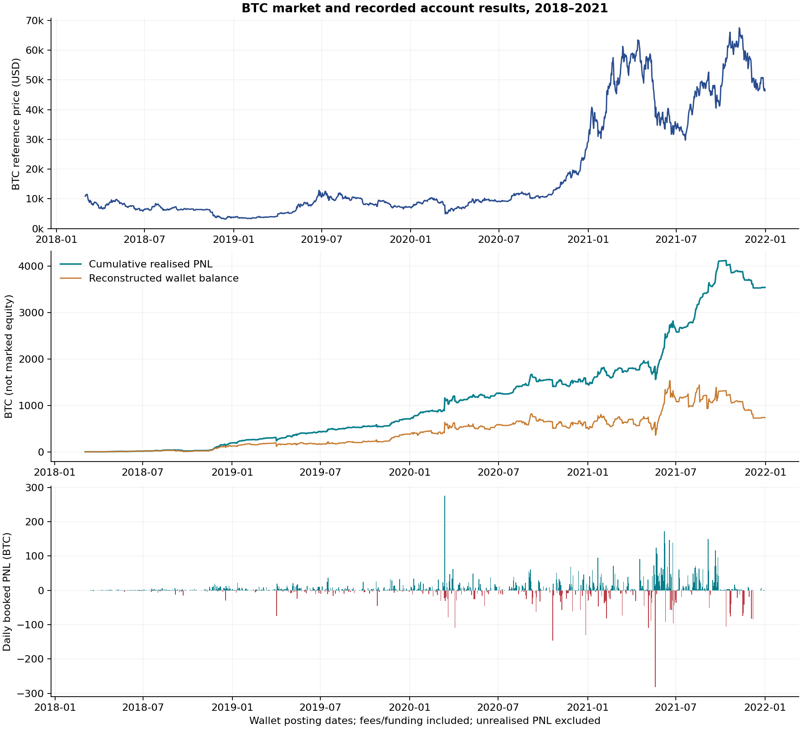

# BTC-Legend

**English is the default. [한국어](README.ko.md)**

Empirical research on the supplied `aoa` trading and wallet export attributed by its provider to **워뇨띠 (Wonyotti)**. The requested study period is **1 March 2018–31 December 2021**. The first observed account event is **5 March 2018**. Attribution, authenticity and completeness outside these files have not been independently established.

The project studies execution, inventory, realised performance, losses, collateral and market conditions. Its present deliverable is research, with no live trading, trade recommendations or exchange account integration. Future simulation or trading software is not categorically prohibited. No Git repository was initialized, and nothing was committed or pushed.

## Read the research

| Document | English | Korean |
| --- | --- | --- |
| Findings, historical/current comparison, transferability | [Research report](reports/research.en.md) | [연구 보고서](reports/research.ko.md) |
| Follow-up: accounting discrepancy attribution | [Accounting audit v0.2](reports/accounting-audit.en.md) | [회계 차이 추적 v0.2](reports/accounting-audit.ko.md) |
| Follow-up: large gains, losses and liquidations | [Event study v0.3](reports/event-study.en.md) | [극단 손익·청산 연구 v0.3](reports/event-study.ko.md) |
| Follow-up: full portfolio inventory and reference risk | [Portfolio risk v0.4](reports/portfolio-risk.en.md) | [전체 포트폴리오 위험 v0.4](reports/portfolio-risk.ko.md) |
| Historical marks, intraday exposure and flow-adjusted performance | [Risk and returns v0.5](reports/marks-intraday-returns.en.md) | [마크가격·장중 노출·수익률 v0.5](reports/marks-intraday-returns.ko.md) |
| Priority 4: changes in trading behaviour | [Behaviour v0.5](reports/behavior-changes.en.md) | [매매 행동 변화 v0.5](reports/behavior-changes.ko.md) |
| Definitions, accounting, data quality, reproducibility | [Methodology](research/methodology.en.md) | [분석 방법론](research/methodology.ko.md) |
| External source register | [Sources](research/sources.md) | Shared bilingual register |
| Machine-readable findings | [Account summary](results/summary.json), [market summary](results/market_summary.json) | Same numerical outputs |

## Principal observations

- **1,439,207 trade fills**, **23,416 identifiable executed orders**, and **28 liquidation-labelled fills with zero UUID order IDs**. The latter remain in inventory and cost calculations but cannot be assigned real parent orders.
- The event study finds **59 liquidation-labelled fills in total**: the 28 zero-ID fills plus 31 fills of one valid-ID ETHUSD partial-reduction order. Exact timestamp/order grouping yields 29 observable groups, not a verified independent margin-call count.
- **3,537.32369404 BTC** in account-wide net realised ledger PNL. XBTUSD contributes **2,007.08464645 BTC**, approximately **56.74%**. Other contracts matter substantially.
- Completed deposits of **14.48925714 BTC**, withdrawals of **2,814.54321713 BTC**, and final wallet balance of **737.26973405 BTC** reconcile exactly. This is a cash ledger identity, not a total-return calculation.
- XBTUSD has **941,007 fills and 18,397 identifiable orders**. Its reconstructed end position is **short 29,080,100 USD contracts** under an initial-zero-inventory assumption supported by 3,961 funding-position checks.
- The final current-market comparison uses fully closed UTC days through **22 September 2026**, with BTC/USD, BTC/USDT and USDT/USD separately observed.



## Reproduce locally

Python 3.11+ and the packages in `requirements.txt` are sufficient. The supplied source CSVs must remain in `data/` under their original filenames. Commands below run from the project root.

```text
python scripts/analyze.py
python scripts/accounting_audit.py
python scripts/event_study.py
python scripts/event_figures.py
python scripts/portfolio_risk.py
python scripts/portfolio_figures.py
python scripts/research_events.py
python scripts/mark_sample_analysis.py
python scripts/intraday_behavior.py
python scripts/flow_adjusted_returns.py
python scripts/extended_figures.py
python scripts/market_analysis.py
python scripts/figures.py
python -m unittest discover -s tests -v
python scripts/verify.py
python scripts/verify_event_study.py
python scripts/verify_portfolio_risk.py
python scripts/verify_extended_research.py
```

These commands use saved market inputs and do not require network access. `python scripts/fetch_market.py` optionally downloads public market data for the fixed research cutoff; it never uses authenticated or trading endpoints. Do not refresh snapshots before reproducing the published version. Upstream revisions can change later downloads. Source hashes are recorded in `results/manifest.json` and `data/market/retrieval.json`.

For v0.5 on a checkout without the captured provider archives, run `python scripts/fetch_historical_marks.py` after `research_events.py` and before `mark_sample_analysis.py`. It downloads the selected public monthly samples and verifies cached hashes. Raw provider archives and large event caches are excluded from Git; capture logs and derived research tables remain available.

`results/orders.csv` contains identifiable orders. Episode files explicitly marked `conditional` are exploratory estimates, not fully reconciled exchange statements. The original files are never overwritten. Raw account data are excluded by `.gitignore`; source licensing and redistribution are not asserted by this repository. No software/data license has been selected on the owner's behalf.

## Limits that affect interpretation

The [accounting follow-up](reports/accounting-audit.en.md) explains the baseline **0.02745234 BTC** gap as **0.01958048 BTC of out-of-window funding** plus **0.00787186 BTC of inventory cost allocation**. The refined XBTUSD aggregate matches the wallet exactly. Twelve posting dates retain differences of 1–2 satoshis. Of 154 raw wallet snapshot differences, 152 match the source's displayed precision; two dates involve one withdrawal with ambiguous processing chronology. Wallet timestamps remain truncated and ending inventory remains open. NAV returns, exact leverage, Sharpe ratios, liquidation prices, predictive signals and modern profitability are not established.

`results/summary.json` and the conditional episode files retain the v0.1 fill-based baseline. Refined accounting evidence is in [results/accounting_audit/summary.json](results/accounting_audit/summary.json); it does not silently replace the original episode statistics.

The [event study](reports/event-study.en.md) attributes the best account posting day (+275.53795475 BTC) to XBTUSD and XBTH20, and the worst (−281.83947272 BTC) to XBTUSD and ETHUSD. Separate v0.3 episodes include funding and preserve the open ending position. Rankings, source references, liquidation groups and hourly case paths are under [results/event_study](results/event_study/summary.json).

The [portfolio study](reports/portfolio-risk.en.md) reconstructs all 46 contracts and eight settlements. Every contract's aggregate PNL matches the ledger, and all 5,368 funding quantities match inventory. Daily spot-reference valuation and eight static stress scenarios include BTC collateral and USD/USDT conversion. They are conditional scenarios, not exchange-mark NAV or actual leverage. Historical specifications override five currently reused USDT symbols. Inputs are saved separately in `data/portfolio_market/`; offline results are in [the portfolio summary](results/portfolio_risk/summary.json).

The [v0.5 extension](reports/marks-intraday-returns.en.md) acquires 54 historical mark/index files for 33 monthly sample days, reconstructs intraday inventory, and studies cash-flow timing sensitivity. Its return scenarios retain spot-reference valuation and do not establish a full-period actual NAV return. The [behaviour study](reports/behavior-changes.en.md) finds fewer, larger XBTUSD executed orders, longer completed holding episodes and greater late-period altcoin contribution. Counts use parent orders rather than treating fragmented fills as independent decisions. Results and validation are under `results/extended_research/`.
