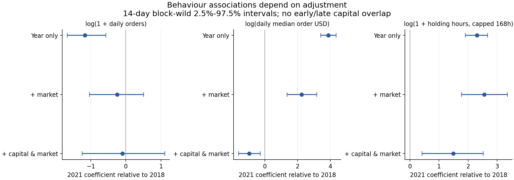
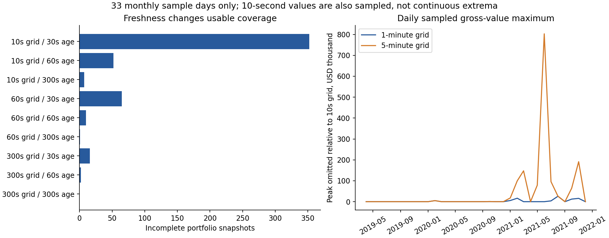
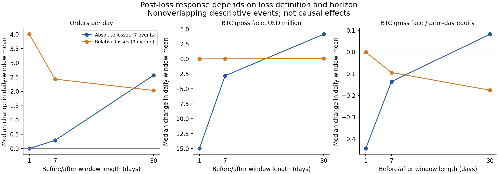

# Behaviour, attribution and robustness

Priorities 5-8, v0.6, 23 September 2026. **English is the default. [한국어](behavior-attribution-robustness.ko.md)** · [Previous behaviour study](behavior-changes.en.md) · [Marks and returns](marks-intraday-returns.en.md)

This extension asks whether observed behaviour changes survive statistical adjustment, where the account's gains came from, which conclusions depend on modelling choices, and how risk changed after large losses. It reuses the supplied 2018-2021 account records and saved market observations. No current-market feed is refreshed, and no trading rule is fitted or recommended.

The strongest conclusions are accounting identities and observed changes in activity. Attributing those changes to an independent improvement in skill is much harder: early and late capital ranges do not overlap, valuation is incomplete, and large-loss event samples are small. Results below retain those distinctions.

## 5. What explains the change in behaviour?

### Design and dependence

Three outcomes are studied: `log(1 + daily XBTUSD executed-order count)`, `log(daily median XBTUSD order face value in USD)` on active days, and `log(1 + episode hours capped at 168)` by entry cohort. An identifiable parent order is the activity unit, not an individual fragmented fill. Counts include zero-order days; order-size observations do not invent a zero-size order on those days.

Each outcome is fitted to three OLS specifications using the same complete-case sample: year indicators alone; year plus prior-day log BTC/USD price, log 30-day annualised volatility and 30-day return; then those variables plus log prior-day reference equity in USD. The prior-day convention avoids using the day's closing market information to explain that day's order activity. It does not make capital exogenous. Capital itself reflects previous trading, withdrawals and market prices.

Uncertainty is explored with 7-, 14- and 28-calendar-day dependence blocks. Daily score sums feed Bartlett HAC standard errors, including repeated episode entry dates and zero-score missing dates. A separate fixed-design block-wild calculation applies a common Rademacher residual sign within each block, with 499 deterministic draws. Displayed intervals are its 2.5th and 97.5th percentiles. They are conditional, exploratory intervals, not simultaneous confidence guarantees, causal tests or forecasts. The HAC reference is the [official statsmodels documentation](https://www.statsmodels.org/stable/generated/statsmodels.stats.sandwich_covariance.cov_hac.html); this repository implements and tests the calculation in NumPy without a statsmodels dependency.

### Results

The following coefficients compare 2021 with 2018. Values are in the stated transformed outcome units; they are not raw percentage-point changes or average holding-hour differences.

| Outcome | Observations | Year only | Market adjusted | Capital + market adjusted | 14-day block interval, final model |
| --- | ---: | ---: | ---: | ---: | --- |
| Log(1 + daily orders) | 1,389 days | −1.167 | −0.249 | −0.099 | [−1.249, 1.108] |
| Log(daily median USD face) | 1,026 active days | 3.870 | 2.248 | −0.944 | [−1.598, −0.277] |
| Log(1 + capped holding hours) | 2,571 episodes | 2.304 | 2.553 | 1.489 | [0.418, 2.523] |

After adjustment, the residual year association with order frequency is uncertain. The size coefficient changes sign when capital is added, while the holding-duration association remains positive under all three block lengths. This does **not** establish that the trader would have used smaller orders in 2021 at the same capital. The observed capital required for that comparison does not exist in the data.

The maximum prior-day reference equity in 2018 is about **USD 534,315**, while the minimum in 2021 is about **USD 12,267,063**. The ranges do not intersect. Full models are numerically full rank but have design condition numbers around 556-615 in the chosen units. They extrapolate when separating year from capital. Adjusted coefficients therefore describe a model-dependent association, not an identified independent strategy change. A narrower statistical interval cannot repair this lack of comparable observations.



### Holding duration without discarding the ending position

The earlier completed-episode statistics can be affected by exit-year composition. Here episodes are assigned to entry year, and the endpoint is `min(duration, 168 hours)`. The final open episode has more than 168 hours of follow-up, so its capped outcome is fully observed. All 2,590 XBTUSD episodes, including that open episode, have an observed seven-day endpoint; 19 lack regression controls and are excluded only from the adjusted model.

| Entry year | Episodes | Mean capped duration, hours | Open at export end |
| --- | ---: | ---: | ---: |
| 2018 | 1,755 | 2.890 | 0 |
| 2019 | 433 | 18.190 | 0 |
| 2020 | 277 | 26.751 | 0 |
| 2021 | 125 | 43.851 | 1 |

These are means of capped durations, not estimates of unrestricted mean holding time. They intentionally cannot distinguish a seven-day position from a much longer position. Right censoring is the reason for that endpoint choice; the [statsmodels duration documentation](https://www.statsmodels.org/stable/duration.html) describes the general censoring problem. No proportional-hazards model or unobserved closing date is invented here.

Evidence: [all coefficients and block intervals](../results/robustness_research/behavior_models.csv), [diagnostics](../results/robustness_research/model_diagnostics.csv), [capital support](../results/robustness_research/capital_support.csv), [entry-cohort endpoints](../results/robustness_research/holding_entry_cohorts.csv).

## 6. Where did the gains come from?

### BTC accounting bridge

Contract-level gross realised PNL, signed execution commissions and funding come from the reconciled event reconstruction. Positive fee/funding contributions mean net credits; negative values mean charges. Gross BTC-contract PNL includes all BTC-underlying products, not just XBTUSD. Altcoin gross PNL covers the remaining underlyings. Unrealised PNL uses the retained daily spot-reference scenario, including its explicit valuation gap.

| Year | BTC-contract gross | Alt-contract gross | Fee credit/charge | Funding credit/charge | Change in reference unrealised | Additive gain, BTC |
| --- | ---: | ---: | ---: | ---: | ---: | ---: |
| 2018 | 229.5892 | 2.9320 | −35.6077 | −5.0508 | 0.0032 | 191.8659 |
| 2019 | 534.4728 | 11.3090 | −24.2095 | −6.3049 | −0.0035 | 515.2638 |
| 2020 | 735.3403 | 76.8262 | −40.2364 | −10.1595 | −5.5572 | 756.2133 |
| 2021 | 944.5206 | 930.8535 | 21.9779 | 171.0907 | 63.6692 | 2,132.1120 |
| Total | 2,443.9229 | 1,021.9206 | −78.0756 | 149.5754 | 58.1117 | **3,595.4550** |

The unrounded bridge is **3,537.34327452 BTC of full-calendar net realised PNL + 58.11172056 BTC ending reference unrealised PNL = 3,595.45499508 BTC**. The realised figure exceeds the wallet posting-window total by the already reconciled **0.01958048 BTC** of late funding. The additive gain also equals ending reference equity plus withdrawals minus deposits. It is not a compounded return, and it does not make the incomplete 2018 return chain valid.

The 2021 gross contribution is much more diversified than an XBTUSD-only explanation: alt contracts contribute 930.8535 BTC before their fees and funding. Net funding adds 171.0907 BTC account-wide in that year, and net execution commissions become a credit of 21.9779 BTC. These are realised accounting components. They do not identify whether funding collection, basis trading or another intention motivated the positions. Gross contributions here differ deliberately from the earlier net asset contribution percentages.

### USD conversion and collateral

Let `W` be wallet BTC, `U` reference unrealised BTC, `P` BTC/USD, `F` external BTC flow, and `R` net realised BTC. With end-of-day cash conversion:

```text
E = (W + U) * P
G_USD[t] = E[t] - E[t-1] - F[t] * P[t]
         = W[t-1] * (P[t] - P[t-1])
         + U[t-1] * (P[t] - P[t-1])
         + (R[t] + U[t] - U[t-1]) * P[t]
```

The last term is split into gross BTC-contract PNL, gross alt-contract PNL, fee credit, funding credit and unrealised change. The formula is an exact accounting decomposition under this conversion convention. Allocating cross-terms differently would give a different attribution while preserving the total.

| Full-period USD component | USD million |
| --- | ---: |
| Prior wallet BTC revaluation | 40.601787 |
| Prior unrealised BTC revaluation | 1.141506 |
| Gross BTC-contract PNL at daily conversion | 43.942964 |
| Gross alt-contract PNL at daily conversion | 29.640729 |
| Net fee credit at daily conversion | 0.120221 |
| Net funding credit at daily conversion | 10.046374 |
| Daily reference unrealised change at daily conversion | 1.552270 |
| **Additive reference gain with EOD flows** | **127.045852** |

Thus part of the USD wealth increase is the changing USD value of BTC already held in the wallet. It cannot all be attributed to directional trade selection. The positive USD fee contribution alongside a negative cumulative BTC fee contribution is possible because credits and charges occur at different BTC/USD prices. These USD figures are not historical cash conversions actually executed by the account or a realised USD brokerage statement.

The unknown UP-option reference value on 3 May 2018 makes two daily changes incomplete, on 3 and 4 May. Both missing residuals remain missing. Annual endpoints are available, and annual contribution sums happen to reconcile within USD 0.000001; that aggregate identity does not supply the missing intraday or daily option values. Unrealised attribution is conditional throughout, including on otherwise complete daily rows.


Historical USDT-labelled quanto contracts remain BTC-settled. Their reference quotes use altcoin USD divided by USDT/USD, as in v0.4. USDT/USD effects are embedded in the reference revaluation; this study does not label them as a separately identified causal factor. Nor does it assign a full-period basis profit using monthly mark observations. The earlier same-time mark/index comparison remains the directly supported basis-valuation evidence.

Evidence: [daily bridge](../results/robustness_research/attribution_daily.csv), [annual bridge](../results/robustness_research/attribution_yearly.csv), [asset-level realised components in satoshis](../results/robustness_research/realised_components_by_asset.csv).

## 7. Which findings survive changes in assumptions?

### Historical mark sampling and freshness

The same 54 captured files are re-evaluated on 10-second, 60-second and 300-second nested grids, with 30-, 60- and 300-second maximum record ages. Both exchange and collector timestamps must precede the valuation instant. Prices are required for every active position and the BTC conversion index. Missing prices make portfolio observations incomplete. The 60-second/300-second setting reproduces all v0.5 sampled equity values.

| Grid | Total snapshots | Valid with 30s age | Valid with 60s age | Valid with 300s age |
| --- | ---: | ---: | ---: | ---: |
| 10 seconds | 285,120 | 284,768 | 285,068 | 285,113 |
| 60 seconds | 47,520 | 47,455 | 47,510 | 47,519 |
| 300 seconds | 9,504 | 9,488 | 9,502 | 9,504 |

At 300-second freshness, the largest daily peak omitted by the one-minute grid relative to ten seconds is **USD 26,024 on 1 August 2021**. The largest omission for five-minute sampling is **USD 802,893 on 1 June 2021**. The maximum absolute same-time mark/index equity difference is USD 923,468 at ten seconds, USD 922,926 at one minute, and USD 905,387 at five minutes.

These comparisons quantify sampling sensitivity **on 33 month-start days only**. Ten-second sampling also misses within-grid extrema. Stricter freshness changes coverage, so extrema across freshness settings are not estimates on identical usable observations. A coarse grid having no missing points does not mean its underlying feed is more complete. None of the settings establishes the full-period maximum market-value exposure or maintenance-margin headroom.



### Order grouping, cost allocation and cash timing

As an additional descriptive grouping, adjacent same-side real XBTUSD orders are merged when their intervals overlap or their gap is at most 0, 1, 10 or 60 seconds. A side change and a year boundary start a new group. This conserves traded quantity and does not overwrite parent IDs or claim to discover human decisions. Under 60-second grouping, 2018 has 7,233 groups with a USD 200,000 median face, while 2021 has 1,539 groups with a USD 6.2 million median. The broad pattern of fewer, larger groups survives, but their exact count and size depend on the rule.

The existing XBTUSD cost-allocation alternatives are also exposed together. Fill-level floating allocation differs from the wallet aggregate by 0.00787186 BTC; timestamp/order batch allocation with integer half-even rounding matches the aggregate and has at most two-satoshi daily discrepancies. Floor rounding also matches the aggregate but has a maximum 492-satoshi daily discrepancy. Agreement of a lifetime sum therefore does not establish the correctness of daily attribution. These alternatives are accounting hypotheses, not interchangeable trading-decision definitions.

| Year | Conditional BTC linked return range | Timing spread, percentage points |
| --- | ---: | ---: |
| 2018 | Unavailable in all three scenarios | Unavailable |
| 2019 | 1,255.13%-1,344.73% | 89.60 |
| 2020 | 329.86%-345.65% | 15.79 |
| 2021 | 679.57%-683.72% | 4.15 |

The cash timing table re-expresses the existing beginning/middle/end-of-day scenarios; it is not a new actual NAV estimate. The 2019 USD return spread is 174.17 percentage points, reinforcing that a precise-looking return requires a precise flow convention. No full-period percentage return is linked across invalid 2018 days. The mark sample has no external-flow days, so it cannot independently validate the chosen intraday cash timing.

Evidence: [297 date/settings combinations](../results/robustness_research/mark_grid_sensitivity.csv), [order grouping](../results/robustness_research/order_aggregation_sensitivity.csv), [accounting alternatives](../results/robustness_research/accounting_sensitivity.csv), [BTC and USD cash scenarios](../results/robustness_research/cash_timing_sensitivity.csv). The 7/14/28-day uncertainty sensitivity is in the priority-5 coefficient table.

## 8. How did risk change after large losses?

### Event construction and clocks

The eligible event window is 5 April 2018 through 1 December 2021 to retain 31 prior days and 30 subsequent days. This **excludes the earliest liquidation period**; it is not a replacement for the v0.3 liquidation study. Among 436 eligible negative ledger posting days, the worst 5% yield 22 candidates. A severity-first greedy selection requires event centres to be at least 62 days apart, preventing the chosen before/after windows from overlapping. The cutoff uses the full historical sample and is a retrospective definition, not a signal known in advance.

Two definitions are retained:

- Absolute loss: at most **−56.31065626 BTC**, leaving **7 separated events**.
- Relative loss: at most **−16.4300%** of reference BTC equity at the close of day `t-2`, leaving **9 separated events**. This is a realised loss divided by a prior reference capital estimate, not a daily NAV return.

Ledger posting day `t` covers approximately noon `t-1` to noon `t`. For horizon `h`, the pre-window is UTC days `t-h-1` through `t-2`; the post-window is `t+1` through `t+h`. Days `t-1` and `t` are excluded from behaviour comparisons. Matching uses only information through `t-2`. The post-window deliberately omits the remaining half-day after posting; direct event-to-next-action clocks are separately measured from noon on `t`.

### Observed response

Each cell below is the median across events of the change in before/after **daily-window means**. The exposure ratio uses each observation day's prior reference equity; it is not actual exchange leverage. BTC gross face sums inverse BTC-contract face values and excludes altcoin notional.

| Loss definition | Horizon | Orders/day change | BTC gross face change, USD million | Gross face / prior equity change |
| --- | ---: | ---: | ---: | ---: |
| Absolute, 7 events | 1 day | 0.000 | −15.000 | −0.445 |
| Absolute, 7 events | 7 days | 0.286 | −2.822 | −0.136 |
| Absolute, 7 events | 30 days | 2.567 | 4.126 | 0.082 |
| Relative, 9 events | 1 day | 4.000 | approximately 0 | approximately 0 |
| Relative, 9 events | 7 days | 2.429 | 0.014 | −0.094 |
| Relative, 9 events | 30 days | 2.033 | 0.049 | −0.176 |

Five of seven absolute-loss events have lower next-day BTC gross face. The median decline is substantial, but the 30-day median change becomes positive. Relative-loss selection brings three 2018 events into the sample and removes some large-capital late events; next-day median gross reduction is just USD 1. These results do not support a universal fixed de-risking or fixed cooling-off rule.



For the absolute-loss sample, the first subsequent increase in absolute XBTUSD position occurs between **0.286 and 77.878 hours** after the posting boundary. This may enlarge an existing position; it is not necessarily a new entry from flat. Direct sign reversal is separately recorded and excludes closing flat followed by later re-entry. These clocks describe observable actions, not revenge trading, conviction or emotional state.

Five of seven absolute-loss events recover their pre-event cumulative realised ledger PNL within 30 days. Six recover before the export ends; the 13 October 2021 event remains unrecovered at that endpoint. Seven of nine relative-loss events recover within 30 days, and all nine within the export. Recovery excludes deposits and withdrawals by using cumulative realised PNL, but also excludes unrealised losses and gains, so it is **not equity or wealth recovery**. The unrecovered event is censored, not assigned an infinite or zero duration.

### Comparison dates and inference limits

Controls use the same calendar year and lagged market regime, with the nearest standardised Euclidean distance in log capital, log volatility and 30-day return. Candidate controls are more than 61 days from selected loss events, more than 32 days from every tail-loss candidate, and at least 62 days from previously selected controls. Feature scales use the historical panel, and matching is retrospective. No outcome is used to minimise the distance, but control exclusion uses the known loss history.

Only **four controls** remain for each loss definition. Some are weak matches: maximum distance is approximately 1.374 in the absolute sample and 2.046 in the relative sample. There is no enforced distance caliper; all distances and candidate counts are exported. For 30-day exposure-ratio changes, the median event-minus-control change is **+0.314** in the absolute sample and **−0.032** in the relative sample. Missing order-size observations further reduce some pair counts. Fractions and medians exclude missing values and publish valid denominators.

Matching therefore provides a limited descriptive comparison, not a causal estimate of how a loss changed behaviour. The small sample, selection by realised PNL, reference valuation, endogenous capital, severity-based declustering and survivorship of this one account prevent generalisation to a repeatable profitable risk rule.

Evidence: [absolute events and recovery](../results/robustness_research/loss_events.csv), [absolute controls](../results/robustness_research/loss_matched_controls.csv), [window observations](../results/robustness_research/loss_response_windows.csv), [absolute summary](../results/robustness_research/loss_response_summary.csv), [relative selection](../results/robustness_research/relative_loss/loss_selection.json), [relative events](../results/robustness_research/relative_loss/loss_events.csv), [relative controls](../results/robustness_research/relative_loss/loss_matched_controls.csv), [relative summary](../results/robustness_research/relative_loss/loss_response_summary.csv).

## Reproduction and remaining evidence needs

Run after the v0.5 outputs exist, using Python, NumPy, pandas and matplotlib:

```text
python scripts/research_priorities.py
python scripts/research_sensitivity.py
python scripts/robustness_figures.py
python -m unittest discover -s tests -v
python scripts/verify_research_robustness.py
```

All analysis commands use saved inputs. Raw mark archives can be reacquired with the documented v0.5 fetch step if absent, subject to provider availability and hash checks. [Validation](../results/robustness_research/validation.json) records 32 passing controls, including original account hashes, exact realised totals, annual/daily bridges, missing-value preservation, regression sample consistency, nested price grids, and event exclusions. The full suite has 38 passing unit tests, including an independent pairwise-kernel check of calendar HAC. [Input hashes](../results/robustness_research/input_manifest.json) record reused files. Four figures were rendered and visually checked.

The next evidentiary gains would come from continuous historical mark/index and margin-tier records, independently validated intraday cash timestamps, and preregistered tests on additional accounts or disjoint market periods. Current-market transferability still requires actual fees, liquidity, collateral mechanics and out-of-sample evidence for the proposed strategy. This release explains the historical record more precisely; it does not establish that the same behaviour is profitable today.
