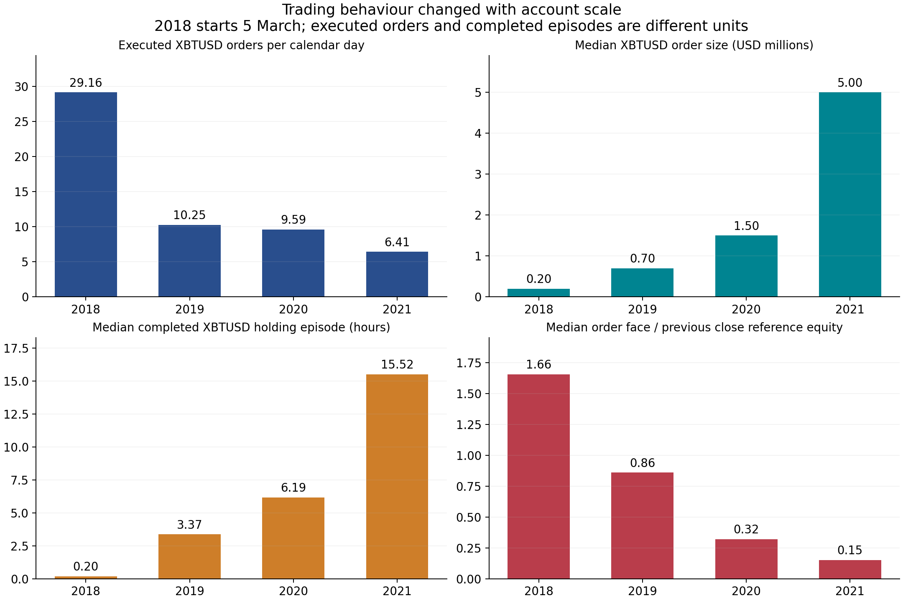

# Changes in trading behaviour

Priority 4 research, v0.5, 23 September 2026. [한국어](behavior-changes.ko.md) · [Marks, intraday risk and returns](marks-intraday-returns.en.md) · [Event study](event-study.en.md)

## Main finding

The supplied account does not exhibit one constant trading style. From 2018 to 2021, XBTUSD trading shifts toward **fewer executed orders, larger absolute orders and longer completed holding episodes**. However, median order size relative to preceding reference equity falls sharply. The late-period account also has much greater altcoin activity and realised contribution. These are measured changes, not proof of why the trader made them or a transferable entry signal.

The analysis covers all **1,439,207 trade fills**, **23,416 identifiable executed orders** and **28 zero-order-ID fills**. Settlement events remain in inventory, and all 59 liquidation-labelled fills remain in activity totals. No losing period or tail event is removed.

## 1. Units and classification

An executed order groups a valid `(symbol, orderid)` across all its timestamps. It is counted on the first fill date, and its size includes all observed fills. This measures completed execution history, not a real-time predictor: later fills of that same order are included. Unfilled and cancelled orders are absent. A human decision can create several orders, so order count is still not decision count. Zero IDs are retained as separate unidentified fills, never invented parent orders.

A holding episode starts when inventory leaves zero or reverses sign and ends when it returns to zero or reverses again. Adds and partial reductions do not automatically create new episodes. Settlements close inventory. XBTUSD episode boundaries match v0.3. Duration statistics use completed episodes grouped by **exit period**; the final open episode is right-censored and excluded from completed-duration and realised-win comparisons. This choice can overrepresent short completed spells relative to ongoing ones, especially in small late-period cohorts.

Direction time is measured across all BTC inverse contracts, while order size, maker share and holding statistics below focus on XBTUSD for comparability. Maker share is quantity/face-volume weighted from `AddedLiquidity` fills, not the proportion of orders marked as limit orders. Intraday add/reduce/reverse batch counts are saved, but their mechanical fill granularity prevents treating each batch as a new deliberate decision.

Cross-asset turnover is explicitly a **USD proxy**: BTC inverse face value is exact; other contracts use recorded absolute BTC execution cost converted at the preceding daily BTC reference. This supports composition comparisons without directly summing incompatible contract counts. It is not spot cash turnover, capital invested or a mark-value risk measure.

## 2. Yearly change

| Metric | 2018* | 2019 | 2020 | 2021 |
| --- | ---: | ---: | ---: | ---: |
| Calendar days | 302 | 365 | 366 | 365 |
| XBTUSD executed orders | 8,805 | 3,740 | 3,511 | 2,341 |
| XBTUSD orders/calendar day | 29.16 | 10.25 | 9.59 | 6.41 |
| Median XBTUSD order face, USD | 200,000 | 700,000 | 1,500,000 | 5,000,000 |
| Median XBTUSD fills/order | 8 | 31 | 51 | 96 |
| Median order / prior reference equity | 1.6551 | 0.8596 | 0.3210 | 0.1524 |
| XBTUSD maker volume share | 64.56% | 67.91% | 70.41% | 77.08% |
| Completed XBTUSD episodes | 1,754 | 433 | 277 | 125 |
| Median completed duration, hours | 0.1967 | 3.3734 | 6.1871 | 15.5209 |
| 90th percentile duration, hours | 6.39 | 55.64 | 93.79 | 153.30 |
| BTC inverse net-short share of calendar time | 39.13% | 71.78% | 66.66% | 53.84% |
| Altcoin share of total turnover proxy | 10.49% | 0.78% | 1.06% | 25.22% |

*2018 starts on the first observed event date, 5 March. Calendar-day denominators include inactive days. Prior-equity ratios exclude missing/nonpositive denominators and use v0.4 spot-reference equity. They are sizing descriptors, not order leverage or total portfolio leverage.*

The median absolute order grows **25-fold**, while its median fraction of preceding equity falls from about **165.5% to 15.2%**. Larger orders therefore do not by themselves establish more aggressive sizing relative to the account. At the same time, increasing gross inventory, persistent positions and cross-contract offsets mean that a smaller individual-order ratio does not establish lower total portfolio risk.

Fragmentation materially changes the visual impression of activity. Total fills rise from **163,142 in 2018 to 748,684 in 2021**, while total identifiable executed orders fall from **11,854 to 3,945**. XBTUSD median fills per order rise from 8 to 96. A fill-count chart alone would suggest more frequent trading, even though the observed parent-order frequency falls. This directly addresses the user's concern about one large order appearing as many trades.

Higher annual maker share is consistent with a larger proportion of executed volume adding liquidity. It does not prove profitability from market making, absence of adverse selection, lower opportunity cost or a particular algorithm. Lost/cancelled quotes and order-book states are not supplied.

Evidence: [yearly statistics](../results/extended_research/behavior_yearly.csv), [quarterly statistics](../results/extended_research/behavior_quarterly.csv), [daily instrument activity](../results/extended_research/activity_daily_symbol.csv), [holding episodes](../results/extended_research/holding_episodes.csv).

## 3. The late-period shift is not uniform

| 2021 quarter | XBTUSD orders | Orders/calendar day | Maker volume share | Median completed hours | Completed episodes | Alt turnover proxy share |
| --- | ---: | ---: | ---: | ---: | ---: | ---: |
| Q1 | 848 | 9.42 | 84.25% | 12.03 | 47 | 5.56% |
| Q2 | 883 | 9.70 | 77.65% | 16.74 | 44 | 29.49% |
| Q3 | 532 | 5.78 | 68.82% | 33.25 | 30 | 32.43% |
| Q4 | 78 | 0.85 | 73.62% | 417.09 | 4 | 42.63% |

Q4's duration median is based on **only four** completed episodes, with an open ending position excluded. It is evidence about that small observed cohort, not a stable estimate of a permanent strategy. The quarterly maker series also falls substantially before rebounding, despite the rise in the annual 2018–2021 comparison. A smooth story of continuously increasing patience or passivity would overstate the data.

The all-account source ledger gives a second view of diversification by **net realised contribution**, which differs from turnover share:

| Posting year | All-account realised PNL, BTC | BTC-underlying contracts, BTC | Other underlying assets, BTC |
| --- | ---: | ---: | ---: |
| 2018 | 188.4257 | 191.3162 | −2.8905 |
| 2019 | 516.3729 | 505.1372 | +11.2357 |
| 2020 | 763.6426 | 692.3731 | +71.2696 |
| 2021 | 2,068.8824 | 992.9325 | +1,075.9499 |

In 2021, non-BTC-underlying contracts contribute about **52.01%** of net realised account PNL, and ETH alone contributes about **930.9645 BTC**. The larger late-period outcome cannot be explained by XBTUSD trading alone. The BTC category includes BTC futures and the UP instrument, not only XBTUSD. This is source-ledger attribution by posting year and does not measure independent alpha or an underlying asset's contribution to marked total return. [Ledger by underlying](../results/extended_research/ledger_yearly_by_asset.csv).

## 4. Market regimes and event windows

To check whether yearly comparisons merely reflect different trend regimes, daily observations are also grouped by the previously defined **lagged 30-day BTC return**: above +10%, below −10%, or between those values. Only information available before the observation day enters the regime label. The groups are descriptive and have unequal duration; they are not matched counterfactuals.

Comparing 2018 with 2021 within each regime, XBTUSD order frequency remains lower and median order face remains larger. In the falling-price regime, orders/calendar day decline from **38.14 to 7.44**; in the rising regime, from **32.90 to 7.06**; in the middle regime, from **19.07 to 4.51**. This makes changing trend-state composition alone an incomplete explanation. Account size, volatility, liquidity, instrument availability and serial dependence remain confounders. [Year/regime comparisons](../results/extended_research/behavior_year_regime.csv).

Two fixed event windows compare the 30 calendar days before and after 12 March 2020 and 19 May 2021, excluding the event day:

| Event | XBT orders/day, before → after | Median order USD, before → after | Maker share, before → after | Median completed hours, before → after |
| --- | ---: | ---: | ---: | ---: |
| 2020-03-12 | 10.77 → 20.83 | 1,500,000 → 590,502 | 70.73% → 71.05% | 13.64 → 1.21 |
| 2021-05-19 | 8.57 → 12.73 | 5,000,000 → 5,000,000 | 71.53% → 81.72% | 24.00 → 20.05 |

The March 2020 aftermath shows more frequent, smaller orders and shorter completed episodes. The May 2021 aftermath shows more orders and higher maker share, but unchanged median order face; median daily peak BTC gross face rises from approximately **USD 27.36 million to 44.86 million**. These windows do not support a universal response such as “always reduces exposure after a shock.” They cannot establish learning, intention, emotional state or causality. [Window calculations](../results/extended_research/behavior_event_windows.csv).

## 5. Higher profits do not mean steadily improving win rates

Using the reconciled v0.3 XBTUSD episodes, including allocated fees and funding:

| Exit year | Completed episodes | Positive-net fraction | Profit factor | Net BTC of episodes closed that year |
| --- | ---: | ---: | ---: | ---: |
| 2018 | 1,754 | 77.82% | 1.7730 | 173.5904 |
| 2019 | 433 | 75.75% | 2.3462 | 517.0004 |
| 2020 | 277 | 65.34% | 1.4070 | 578.2482 |
| 2021 | 125 | 71.20% | 1.4693 | 737.9835 |

Profit factor is the sum of positive net episode PNL divided by the absolute sum of negative net episode PNL. It is not risk-adjusted return. Whole episodes are assigned to their exit year, including any PNL accumulated earlier, so this table does not reconcile by year to wallet posting-year PNL; it answers a different question. The open final episode is excluded, and these are not independent identically distributed bets. [Episode cohort statistics](../results/extended_research/xbt_episode_exit_year.csv).

The observed higher later profits coexist with lower win fractions than in 2018, much larger absolute position scale, longer holding spells, substantial losses and a growing contribution from other contracts. Data support a changing combination of execution style, scale and instrument mix. They do not establish a simple rule that could reproduce the historical outcome today.

## 6. Reproduction and inference limits

`research_events.py` preserves source rows and builds the order, batch and holding tables. `intraday_behavior.py` produces yearly, quarterly, regime and event-window comparisons. `verify_extended_research.py` checks counts and reconciles every daily quantity/cost snapshot against v0.4 and the XBTUSD episode boundaries against v0.3. See the [shared reproduction instructions](marks-intraday-returns.en.md#4-reproduction-and-remaining-evidence-needs) and [validation output](../results/extended_research/validation.json).

No change point was selected by maximising realised profits, and no p-value treats millions of related fills as independent evidence. Year, quarter and two historically motivated event windows are disclosed. They may still be subject to selection and survivor effects. The account's attribution and completeness beyond the supplied export remain unverified. Behaviour research does not recover cancelled orders, external hedges, discretionary reasoning or a deployable modern signal. Original data, losing events and the open endpoint are retained.
