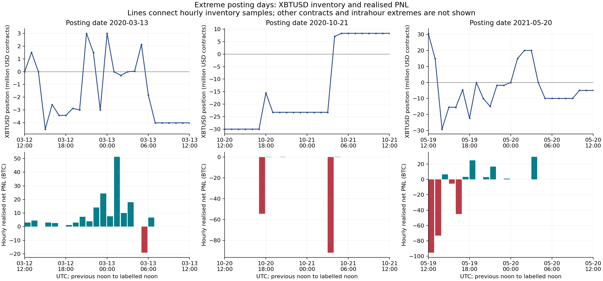
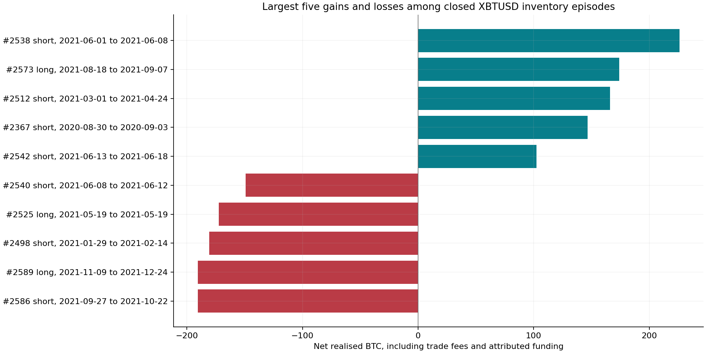

# Large gains, losses and liquidation events

Research v0.3, 23 September 2026. [한국어](event-study.ko.md) · [Accounting foundation](accounting-audit.en.md) · [Numerical summary](../results/event_study/summary.json)

## Findings

Large results arose from several mechanisms: repeated directional changes during a crash, simultaneous positions in different contracts, and large inventories held for days or weeks. Passive execution and funding sometimes helped, but did not prevent substantial losses. A liquidation label describes a particular execution; it does not determine the profit of the preceding position episode or the solvency of the entire account.

The full text scan finds **59 liquidation-labelled fills**, including the previously reported **28 zero-order-ID fills**. The additional 31 fills have one valid ETHUSD order ID and one timestamp. There are **29 timestamp/order groups**, comprising 28 reconstructed flat closes and one partial reduction. These are observable execution groups, not a verified count of independent margin calls.

The largest account profit posting is **+275.53795475 BTC on 13 March 2020**, split between XBTUSD and XBTH20. The largest account loss is **−281.83947272 BTC on 20 May 2021**, split between XBTUSD and ETHUSD. Neither matched reporting window contains a liquidation-labelled fill. The largest XBTUSD loss posting, on 21 October 2020, also contains none.

## 1. Selection and measurement

Selection is mechanical: the largest and smallest ten posting days for both account-wide and XBTUSD ledger PNL, the largest and smallest five completed XBTUSD inventory episodes, and every liquidation-labelled execution across all instruments. Detailed case studies cover the union of the best/worst account and XBTUSD dates, which gives three dates. This is retrospective tail-event research. Selection on realised outcomes precludes claims of predictive effectiveness.

A posting date D covers **[D−1 12:00 UTC, D 12:00 UTC)** under the validated accounting convention. Execution timestamps are treated as UTC, consistently with the previous audit. A position episode runs from flat to flat or to a direction reversal. Reversal fees are split by quantity in integer satoshis; any remainder stays with the opening portion. Funding is assigned to the position episode open at its logical execution time. There are no exact funding/trade timestamp ties in this dataset. The two timestamps with opposite trade directions are tested with reversed order-ID ordering: the closed-episode count, aggregate gross PNL and the top/bottom five net values remain unchanged.

The reconstruction uses the v0.2 timestamp/order/direction batches and recorded execution costs. All 2,589 closed episodes plus one open episode sum to **2,007.10422693 BTC**, including all exported funding. Removing the already identified **0.01958048 BTC** outside the wallet cutoff gives the ledger total. Closed episodes alone contribute **2,006.82252671 BTC**. The open episode contributes **0.28170022 BTC of realised cash components**, not its unmeasured unrealised PNL. The v0.2 twelve daily differences of at most two satoshis remain; all three focus dates match exactly.

Other instruments' contributions come directly from wallet postings. Their contract inventories are conditional on zero initial inventory and the supplied trade history. No settlement precedes the relevant focus or liquidation observations. XBTUSD has the additional 3,961 funding-position checks from the baseline. We do not present non-XBTUSD positions as equally validated cost or margin models.

## 2. Three extreme posting windows

All figures below are BTC, after applicable costs and funding. “Other” identifies the full non-XBTUSD contribution for that date.

| Posting date | Account net | XBTUSD net | Other contribution | Role |
| --- | ---: | ---: | ---: | --- |
| 2020-03-13 | +275.53795475 | +141.73651314 | XBTH20 +133.80144161 | Best account and XBTUSD day |
| 2020-10-21 | −146.12616310 | −146.12616310 | 0 | Worst XBTUSD day |
| 2021-05-20 | −281.83947272 | −134.09976516 | ETHUSD −147.73970756 | Worst account day |

Evidence: [case accounting](../results/event_study/focus_cases.csv), [instrument activity](../results/event_study/focus_instrument_activity.csv), [wallet source records](../results/event_study/ranked_day_wallet_sources.csv).



### 13 March 2020: crash trading in two BTC contracts

The XBTUSD window starts flat and ends short **4,009,670 USD contracts**, with maximum observed absolute inventory **4,500,573**. It contains **4,706 fills across 177 identifiable orders**; maker executions account for **67.05% of traded contracts**. Gross realised PNL is **144.03340805 BTC**, trade charges cost **1.47301217 BTC**, and funding costs **0.82388274 BTC**.

Positions alternate between long and short. For example, hourly endpoints move from long 1.5 million contracts at 13:00 on 12 March, to short 4.500573 million at 15:00, back to long 3.000427 million at 21:00. These are hour-end samples, not a complete intrahour trajectory. The short episode from **13 March 01:02:07 to 02:01:05** earns **61.32367291 BTC** after fees and funding. The 01:00–02:00 hour contributes **51.318022 BTC** of realised XBTUSD net PNL. A single uninterrupted bearish position does not describe the observed path.

XBTH20 contributes another **133.80144161 BTC**, from 276 fills and 12 identifiable orders. Its reconstructed inventory starts at zero, reaches an absolute peak of 3.6 million contracts and ends at one contract. Summing its realised PNL with XBTUSD is legitimate ledger attribution; calling the two independent strategies or a hedge would require more evidence.

Own XBTUSD execution prices range from **USD 3,950 to 6,192**. These are this account's fill prices, not market-wide extrema or liquidation marks. The saved BTC reference series falls **37.535%** on 12 March and rises **13.477%** on 13 March, using UTC daily endpoints. Those daily observations do not measure the noon-to-noon account window.

BitMEX's contemporaneous account describes DDoS-related access disruption at **02:16 and 12:56 UTC on 13 March**. Only the first timestamp lies in this posting window. The profitable short above closes before 02:16. This establishes relevant operational context, not that an outage caused the trader's profits. The export contains filled executions, not failed submissions or cancellations. [BitMEX incident account, 16 March 2020](https://www.bitmex.com/blog/how-we-are-responding-to-last-weeks-ddos-attacks).

The boundary matters: the 126-contract liquidation at **12 March 10:48:12** occurs before this window. Also, the short opened at **13 March 05:41:38** closes at **15:33:33** with a full-episode loss of **63.79264430 BTC**, extending beyond the winning posting day. Ending the narrative at noon would hide that subsequent adverse outcome.

### 21 October 2020: a large short unwound into a long

The window begins short **30,000,915 contracts** and ends long **8,352,601**. Its 2,425 fills belong to only ten identifiable orders; maker share is **63.00%**. Gross loss is **145.62913208 BTC**, fees cost **0.52985219 BTC**, and funding adds **0.03282117 BTC**.

The main short episode runs from **16 October 04:23:19 to 21 October 03:33:03**, with peak size 30,000,915 contracts and net loss **146.38150687 BTC**. Roughly **54.56 BTC** is realised as a loss during 20 October 17:00–18:00 and **91.79 BTC** during 21 October 03:00–04:00. The subsequent long episode earns **5.69275122 BTC**, but ends at 14:21, after the posting cutoff. Mixing its full profit into the earlier day would misstate the ledger comparison.

Own execution prices in the window span USD 11,935–12,215. The BTC reference price rises 1.564% on 20 October and 7.704% on 21 October. The latter daily close occurs after the wallet window ends, so it is later context, not an assumed price observable before the reversal. No liquidation-labelled execution appears in this window; neither that absence nor the loss amount reveals the account's maintenance-margin headroom.

### 20 May 2021: simultaneous XBTUSD and ETHUSD losses

At the window's opening, reconstructed positions are **long 30,702,992 XBTUSD contracts** and **long 181,667 ETHUSD contracts**. At its end they are short 5,001,043 and short 150,000 respectively. ETHUSD quantities have their own quanto contract meaning and must not be added to XBTUSD USD face value.

XBTUSD gross PNL is **−135.36164881 BTC**. Net maker/taker charges are a **1.31552052 BTC rebate**, while funding costs 0.05363687 BTC, giving **−134.09976516 BTC**. Maker share reaches **90.93%**, with 5,652 fills and 67 identifiable orders. Passive fills and rebates clearly coexist with a large directional loss. ETHUSD contributes **−147.73970756 BTC**, with 5,619 fills and 27 orders; its recorded trade charges are a 0.47019643 BTC rebate and funding costs 1.52220109 BTC. These components are already included in net ledger PNL.

The XBTUSD long episode from **19 May 01:55:01 to 13:33:45** loses **172.54882968 BTC**, with peak inventory 40,702,992 contracts before the focus window. Its aggregate entry and exit cost-equivalent prices are approximately USD 40,218 and USD 34,355. These combine all adds/reductions in the episode; they are not single entry/exit quotations.

Reversing short does not immediately solve the loss: the following short episode loses **42.14790398 BTC**. A later short earns **48.94690603 BTC**, and the following long earns **29.58722783 BTC**. Their windows differ from the posting window, so they are not additive replacements for that day's net loss. The sequence demonstrates active resizing and reversals, while leaving the motive and pre-trade signals unidentified.

Own fill prices span USD 31,400–40,400. The UTC daily BTC reference falls **12.029%** on 19 May and rises **8.386%** on 20 May. There are **zero liquidation-labelled fills across the full execution export in 2021**, despite major realised losses. This distinguishes observed forced executions from loss-taking; it does not certify that margin risk was low.

## 3. Large position episodes and their costs

These figures include attributed funding and trade fees under the refined accounting convention. They are inventory lifetimes with many adds and reductions, not ten indivisible trades.

An episode can remain open through a very small residual position. Its duration is not time continuously spent at peak exposure, and the entry/exit cost-equivalent prices aggregate all changes. This study does not measure intraday maximum adverse/favourable excursion: independent mark-price paths and marked portfolio equity are absent.

| Episode | Direction | UTC dates | Duration, days | Peak USD contracts, millions | Net BTC |
| --- | --- | --- | ---: | ---: | ---: |
| 2538 | Short | 2021-06-01 to 06-08 | 7.03 | 58.402 | +226.16080596 |
| 2573 | Long | 2021-08-18 to 09-07 | 19.52 | 74.453 | +173.97281403 |
| 2512 | Short | 2021-03-01 to 04-24 | 53.96 | 80.173 | +166.14197268 |
| 2367 | Short | 2020-08-30 to 09-03 | 4.28 | 24.010 | +146.82615624 |
| 2542 | Short | 2021-06-13 to 06-18 | 4.75 | 70.003 | +102.48325472 |
| 2586 | Short | 2021-09-27 to 10-22 | 25.29 | 60.092 | −190.62116165 |
| 2589 | Long | 2021-11-09 to 12-24 | 44.45 | 70.942 | −190.40946622 |
| 2498 | Short | 2021-01-29 to 02-14 | 15.58 | 55.001 | −180.77096161 |
| 2525 | Long | 2021-05-19 | 0.49 | 40.703 | −172.54882968 |
| 2540 | Short | 2021-06-08 to 06-12 | 3.30 | 64.947 | −149.23641927 |



The largest winning episode earns **230.92706614 BTC gross**, receives a **0.85921474 BTC trade rebate** and pays **5.62547492 BTC funding**. Funding reduces this gain. In contrast, episode 2512 receives **31.44500557 BTC funding**, contributing materially to its result. Funding's role is episode-dependent.

The largest losing episode loses **195.51913322 BTC gross**, pays **0.10684662 BTC trade fees** and receives **5.00481819 BTC funding**. The funding credit cushions but does not reverse the directional loss. Neither maker status nor funding receipts establish a positive expected return.

The ten best account posting days sum to **1,462.88230959 BTC**, or **41.36% of net account PNL**, but **17.92% of all positive-day PNL**. The denominators answer different questions. Positive days total 8,161.73445889 BTC and negative days total −4,624.41076485 BTC. The ten worst days sum to **−1,245.59063586 BTC**, approximately 26.94% of negative-day losses. This is meaningful tail concentration, without implying that almost all gross gains occurred on ten days.

The largest peak-to-trough decline in cumulative realised PNL is **590.97711858 BTC**, from the **12 October 2021** peak to **22 December 2021** trough, unrecovered by export end. The intervening postings comprise XBTUSD **−389.02906519 BTC**, ETHUSD **−211.45449284 BTC**, and XRPUSD **+9.50643945 BTC**. This is a realised-PNL decline, not a marked-equity drawdown or a percentage capital loss. [Contribution table](../results/event_study/drawdown_instruments.csv).

## 4. Liquidation evidence, including the newly found partial reduction

| Population | Observation |
| --- | ---: |
| All liquidation-labelled fills | 59 |
| Zero-order-ID fills | 28 |
| Additional valid-ID ETHUSD fills | 31 |
| Exact timestamp/order groups | 29 |
| Groups ending at reconstructed zero inventory | 28 |
| Partial-reduction groups | 1 |
| Labelled fills of one contract | 5 |
| Labelled fills in 2018 / 2019 / 2020 / 2021 | 57 / 1 / 1 / 0 |

At **14 September 2018 03:15:59.393974**, 31 ETHUSD Buy fills share order `ab8a10fa-1f1f-611e-c659-d9926c3a245c`. Together they close **75,059 contracts** of a reconstructed **300,000-contract short**, leaving **224,941 short**, a reduction of approximately **25.02%**. Filtering only zero UUIDs misses this partial liquidation group. Every labelled fill across the dataset reduces reconstructed absolute inventory, and no settlement precedes these observations. Same-symbol temporal grouping with 1-, 60- or 300-second gaps produces 29 groups; this sensitivity result still does not establish independent margin-call count.

For the 19 XBTUSD labelled fills, the model attributes **−13.68770824 BTC** to those executions after their fees. Their 19 enclosing episodes, including earlier reductions and funding, total **−11.75461497 BTC**. Three enclosing episodes are profitable. The 1-contract residuals closed on 26 May and 10 June 2018 belong to episodes earning **1.20854593** and **0.36372960 BTC**. The 126-contract close on 12 March 2020 belongs to an episode earning **0.59595578 BTC**, whose peak inventory had been 3,000,126 contracts. A final forced residual does not erase earlier realised gains.

The largest loss among these XBTUSD episodes is **−5.97366075 BTC**, a 599,999-contract short ending on **17 July 2018**. It is much smaller in BTC than the extreme unlabelled 2021 losses. This compares nominal amounts across different capital scales; it is not evidence that liquidation was relatively harmless in 2018.

BitMEX's contemporary insurance-fund explanation distinguishes the trader's liquidation/bankruptcy accounting from the engine's later execution and insurance-fund outcome. Therefore these source prices are not independently identified trigger marks or market slippage. Margin mode, collateral assigned to the position, maintenance requirements at each instant and account-wide equity are missing. [BitMEX insurance-fund explanation, 10 February 2019](https://www.bitmex.com/blog/the-bitmex-insurance-fund).

## 5. USD, USDT and what these events establish

All account settlement amounts are BTC. XBTUSD quotes USD face value. ETHUSD and other instruments need their own contract definitions. Saved daily USDT/USD references are **0.994970 on 12 March 2020** and **1.010205 on 13 March**; on 19–20 May 2021 they are approximately 1.002035 and 1.001940. USD/USDT parity cannot simply be assumed even around the same event.

These daily reference observations are descriptive context. We do not convert the trader's intraday BTC gains into a claimed realised dollar return using a later daily close, or treat `BTC/USD ÷ USDT/USD` as an observed executable BTC/USDT quote. Historical intraday USD/USDT quotes, venue marks and full portfolio margin paths would be needed for tighter stress measurements.

The observations support hypotheses about resizing, directional reversals, holding-period tails, passive execution costs and cross-contract risk concentration. They do not identify a secret signal or show that copying the trade sequence would work today. Large nominal profits reflect both trading outcomes and changing position scale. The next tests need risk-normalised portfolio reconstruction and pre-trade information, with untouched periods for predictive evaluation.

## 6. Reproduction and evidence map

```text
python scripts/event_study.py
python scripts/event_figures.py
python -m unittest discover -s tests -v
python scripts/verify.py
python scripts/verify_event_study.py
```

The first command verifies original account hashes and runs offline. Existing v0.1 episode files remain unchanged for comparison; v0.3 has separate fee/funding-inclusive outputs. The numerical script uses pandas/numpy, and the figure script uses Matplotlib from the existing requirements.

- [Ranked posting days](../results/event_study/ranked_posting_days.csv) and [contract contributions](../results/event_study/ranked_day_instruments.csv): complete mechanical tail selection.
- [All XBTUSD episodes](../results/event_study/xbtusd_episodes.csv), [extreme episodes](../results/event_study/xbtusd_extreme_episodes.csv), [same-time ordering sensitivity](../results/event_study/same_time_order_sensitivity.json): costs, funding, inventory lifetimes and robustness.
- [Hourly focus results](../results/event_study/focus_hourly.csv), [batch paths with two-day context on either side](../results/event_study/focus_xbtusd_batches.csv), [source row ranges](../results/event_study/focus_source_ranges.csv): reproducible event paths. Ranges locate source records; intervening rows may include other events.
- [All liquidation source rows](../results/event_study/liquidation_events.csv), [grouped executions](../results/event_study/liquidation_groups.csv), [enclosing XBTUSD episodes](../results/event_study/liquidation_xbtusd_episodes.csv): identifiers and chronology. Non-XBTUSD forced-fill PNL is deliberately unavailable, not zero.
- [Daily market context](../results/event_study/focus_market_context.csv) and [verification](../results/event_study/validation.json): source snapshot linkage and reconciliation.

Original CSVs are preserved. Observed executions, conditional accounting reconstruction, and untested behavioural explanations remain separate throughout.
