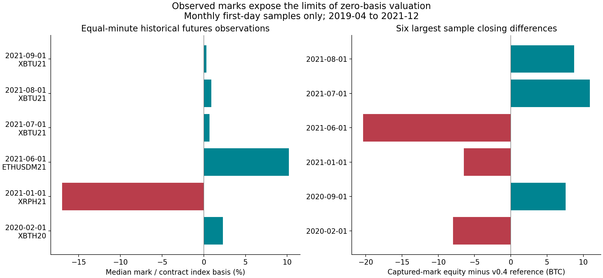
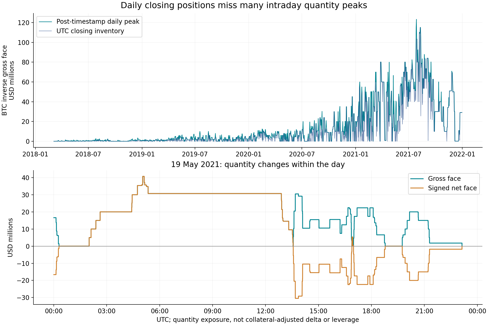
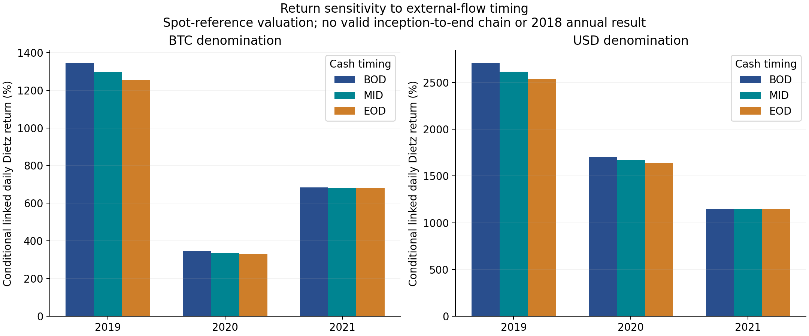

# Historical marks, intraday exposure and cash-flow-adjusted returns

Research v0.5, 23 September 2026. [한국어](marks-intraday-returns.ko.md) · [Behaviour changes](behavior-changes.en.md) · [Previous portfolio research](portfolio-risk.en.md)

## Findings and evidence coverage

This release moves beyond daily zero-basis scenarios, while preserving the distinction between observed marks, reconstructed quantities and conditional performance. Account events cover **5 March 2018 to 31 December 2021**. The requested 1–4 March interval has no observed account event and is not certified as a zero-risk period.

| Research question | Result | Coverage limit |
| --- | --- | --- |
| Historical mark/index prices | 54 captured files, 10 symbols, 33 monthly first-day samples | April 2019–December 2021; not continuous history |
| Sampled portfolio valuation | 47,519 complete minute observations out of 47,520 | One incomplete observation remains missing; no interpolation across days |
| Intraday inventory | 967,961 trade/settlement batches across all 46 contracts | Post-timestamp states; three opposite-side timestamp ties remain ambiguous |
| BTC inverse gross face peak | USD 123,345,200 on 28 July 2021 | A quantity-derived face value, not actual leverage or net delta |
| Flow-adjusted returns | Daily BTC and USD timing scenarios and valid annual chains | Spot-reference valuation; no valid inception-to-end or 2018 annual chain |

All 54 requested public downloads succeeded. The full-period mark archive, 2018 marks and the actual marks on the selected March 2020 / May 2021 loss dates have **not** been obtained. The completed research therefore reports what the available observations establish, rather than filling these gaps with purported exchange prices.

## 1. Historical marks and basis

Tardis documents BitMEX capture coverage beginning on 30 March 2019 and public CSV access for the first day of each month. We selected all 33 eligible month starts, then requested every instrument carried into or traded during each day, plus XBTUSD for BTC/USD index conversion. This deterministic selection includes inactive BTC-position days and avoids choosing only dates with striking basis. [Provider coverage](https://docs.tardis.dev/historical-data-details/bitmex).

The `derivative_ticker` files contain separately named mark, index and last prices, together with exchange and collection timestamps. They are third-party captures of exchange feeds. The funding fields describe upcoming events, so they are not substituted for realised funding charges in the account export. [Provider schema](https://docs.tardis.dev/downloadable-csv-files/data-types.md).

Every minute boundary uses the last record available strictly before that boundary, with availability defined as the later of its exchange and collector timestamps. Records older than 300 seconds by exchange time are rejected. This prevents using future observations and leaves one missing portfolio minute. Freshness is checked at record level; it does not establish that every constituent field, particularly the last trade, changed recently. The daily close means immediately before the next UTC midnight, consistent with v0.4 inventory.

The measured mark/index basis is `10,000 × (mark / index − 1)` in basis points. Equal-minute statistics avoid overweighting periods merely because the feed published more updates. These spreads are not annualised. They refer to each contract's own quote and index, including BTC-quoted cross contracts and historical USDT-quoted quanto products. The latter remain BTC-settled under the v0.4 historical specifications. Trade prices are not renamed marks: BitMEX separately identifies marks as relevant to unrealised PNL and liquidation. [Perpetual guide](https://www.bitmex.com/app/perpetualContractsGuide).

| Sample date | Future | Median mark/index basis | Minute 1st–99th percentile |
| --- | --- | ---: | ---: |
| 2020-02-01 | XBTH20 | +2.2763% | +2.1561% to +2.4326% |
| 2021-01-01 | XRPH21 | −16.9788% | −17.6010% to −15.1349% |
| 2021-06-01 | ETHUSDM21 | +10.1891% | +9.3994% to +10.9830% |
| 2021-07-01 | XBTU21 | +0.6991% | +0.4640% to +1.1710% |
| 2021-08-01 | XBTU21 | +0.8863% | +0.5864% to +1.0427% |
| 2021-09-01 | XBTU21 | +0.3097% | +0.1284% to +0.4944% |

The large XRP and ETH spreads are retained as observations, not trimmed as outliers. XRPH21 is a XRP/BTC linear future; ETHUSDM21 is an ETH/USD quanto future. These are different payoff structures, so their spreads are not interchangeable carry yields or evidence of a risk-free arbitrage. The contemporaneous listing notice confirms the XRP/BTC instrument identity. [Q1 2021 listings](https://www.bitmex.com/blog/q1-2021-quarterly-futures-listings).



At the **1 June 2021 UTC close**, reconstructed equity is **888.85524200 BTC** using captured marks, versus **909.19805707 BTC** using v0.4 spot references, a difference of **−20.34281507 BTC**. This comparison includes both derivative basis and differences between the contemporaneous venue indices and Coin Metrics references. It is not pure basis PNL. The separate same-minute mark-versus-contract-index bridge isolates the valuation effect of replacing each derivative mark with its own index while keeping wallet cash and the BTC conversion price fixed. Its largest absolute sampled portfolio difference is approximately **USD 922,926**, also on 1 June.

All 33 sample dates have no labelled external deposit or withdrawal, so the beginning/end-of-day flow assumptions coincide on those dates. Sample equity still relies on source inventory, reconstructed cash, capture quality and the minute grid. It does not reveal margin mode, maintenance requirements, executable liquidation proceeds or the maximum between minute observations. Monthly marks are never interpolated into a continuous NAV series.

Evidence: [retrieval records](../data/historical_marks/retrieval.json), [basis statistics](../results/extended_research/historical_basis_by_sample.csv), [closing comparisons](../results/extended_research/historical_mark_close_comparison.csv), [sample extremes](../results/extended_research/historical_mark_sample_extremes.csv). Compressed minute observations and position contribution tables are under `results/extended_research/`.

## 2. Intraday exposure reconstruction

Inventory is replayed through every supplied trade and settlement, with funding affecting cash rather than quantity. Order/time/side batches preserve the preceding accounting convention. All changes at one timestamp are applied together for the cross-contract portfolio path. The source has three opposite-side ties, listed separately; arbitrary micro-ordering is not used to claim an intra-timestamp peak.

BTC inverse contracts have USD face values that follow directly from their signed contract quantities. Their gross exposure is `Σ |q|`; net face is `Σ q`. These measures do not require an assumed BTC market price. Every day's starting inventory is carried forward, including days without trades. Time spent long, short or flat is measured from the duration between state changes and totals 24 hours per day.

The largest post-timestamp BTC gross face is **USD 123,345,200**, at **28 July 2021 16:12:29.993437 UTC**:

| Contract | Position | Contribution to BTC gross face |
| --- | ---: | ---: |
| XBTUSD | −83,345,200 | USD 83,345,200 |
| XBTU21 | +40,000,000 | USD 40,000,000 |

BTC net face is therefore **−USD 43,345,200**, while ETHUSD is also short **300,379 contracts**. The BTC legs partially offset but retain basis and maturity risk, and BTC cash can further change USD price sensitivity. The quantities at this headline timestamp were independently summed from the original fills and settlements. [Source-derived peak inventory](../results/extended_research/headline_peak_source_inventory.csv).

On **792 of 1,398 days**, the intraday BTC gross peak exceeds closing gross inventory. The largest daily closing gross value is USD 115,169,400, below the intraday record. On **19 May 2021**, the BTC position reaches **40,702,992 contracts long** at 05:02:14.013175 UTC and later **30,466,395 short**, yet ends the day only **4,981 short**. A near-flat close is therefore poor evidence of low risk during the day.



Cross-asset quantity cannot be added directly. For a full-period comparison, we freeze **the preceding day's** BTC, altcoin and USDT references throughout each current day, then revalue contract notional after each quantity update. This prevents using the current day's future closing price. The largest resulting gross reference value is **USD 188.36 million on 10 August 2021**. It is a fixed-price measure of changing inventory, not the actual intraday market-value maximum. The unpriced UP option makes affected reference observations unavailable. Missing marks are not silently treated as zero economic exposure.

Observed monthly mark samples provide a second layer of sampled market-value exposure, reported separately. Neither layer supplies actual account leverage or liquidation distance. Those require margin/risk-tier history and relevant account state. [Daily extremes](../results/extended_research/intraday_daily_extremes.csv), [contract quantity peaks](../results/extended_research/quantity_peaks_by_contract.csv), [timestamp ambiguities](../results/extended_research/same_timestamp_opposite_sides.csv).

## 3. External flows and conditional performance

Deposits and withdrawals are external capital flows. Realised trading PNL, fees and funding are internal performance components. A withdrawal reduces account equity without necessarily being a trading loss. Withdrawn funds' subsequent investment performance is outside the supplied account and is not inferred.

Daily Modified Dietz scenarios use:

```text
r = (E_end − E_begin − F) / (E_begin + w × F)
w = 1 for beginning-of-day, 0.5 for mid-day, 0 for end-of-day
```

`F` is positive for deposits and negative for withdrawals. BTC-denominated flows retain their source amounts. For USD scenarios, flow conversion uses the previous BTC reference for beginning-of-day, the average of previous/current references for mid-day, and the current reference for end-of-day. All flows on a labelled date share that scenario's timing. This is a sensitivity design, not recovered timestamps. An average reference is not an observed mid-day exchange rate.

A time-weighted calculation ideally values the portfolio around external flows; Dietz approximations cannot recover missing contemporaneous valuation. The methodological reference is the [GIPS handbook](https://www.gipsstandards.org/standards/gips-standards-for-firms/gips-standards-handbook-for-firms/). This project does not claim GIPS compliance.

Annual results below geometrically link the valid daily Dietz estimates. They **all use v0.4 spot-reference equity**, not the sparse historical-mark samples. Percentages are conditional research outputs, not verified investment performance. Timing spreads are neither confidence intervals nor bounds on the true return; mark errors, actual intraday cash timing and FX paths can move results outside them.

| Year | BTC return, EOD to BOD scenario | USD return, EOD to BOD scenario |
| --- | ---: | ---: |
| 2018 partial observed year | Unavailable | Unavailable |
| 2019 | +1,255.13% to +1,344.73% | +2,534.18% to +2,708.35% |
| 2020 | +329.86% to +345.65% | +1,640.62% to +1,704.54% |
| 2021 | +679.57% to +683.72% | +1,145.14% to +1,151.76% |

These large values reflect the model's capital base, substantial withdrawals and changing prices. They cannot be validated by dividing total realised gains by total deposits. BTC and USD answer different denomination questions, with USD additionally reflecting BTC collateral conversion.



The 2018 chain is interrupted by zero/nonpositive effective capital, the unresolved 27–28 April withdrawal dates and the missing 3 May option valuation. A missing end valuation also invalidates the next day's beginning valuation. The implementation never skips these days when linking a month or year, and starts explicitly labelled new segments after gaps. **There is no inception-to-end linked return, CAGR or Sharpe ratio in this release.**

An additive, conditional BTC wealth identity remains available without manufacturing a percentage return:

```text
795.40103509 ending reference equity
+ 2,814.54321713 withdrawals − 14.48925714 deposits
= 3,595.45499508 BTC of flow-adjusted account gain
```

This retains end-position unrealised PNL and uses the source-account boundary. It is not the trader's current net worth or the performance of withdrawn funds. [Daily calculation components](../results/extended_research/conditional_daily_returns.csv), [monthly/annual results](../results/extended_research/conditional_period_returns.csv), [valid segments](../results/extended_research/conditional_return_segments.csv), [source cash flows](../results/extended_research/external_cash_flows.csv).

## 4. Reproduction and remaining evidence needs

Run from the project root after the saved v0.1–v0.4 analysis:

```text
python scripts/research_events.py
python scripts/mark_sample_analysis.py
python scripts/intraday_behavior.py
python scripts/flow_adjusted_returns.py
python scripts/extended_figures.py
python -m unittest discover -s tests -v
python scripts/verify_extended_research.py
```

The analysis is offline when local samples are present. On a checkout without the provider archives, run `python scripts/fetch_historical_marks.py` after `research_events.py`. Downloaded bytes, URLs and timestamps are logged and successful hashes are checked before reuse. Provider archives and large event caches are excluded from Git; public download access does not establish redistribution rights. Original account exports and previous market snapshots remain unchanged.

Verification checks source hashes, all contract cash/quantity/basis totals, every v0.4 daily inventory snapshot, fill/order conservation, funding treatment, the raw-data peak, historical price availability, basis contribution sums, cash formulas and missing-day propagation. [Validation](../results/extended_research/validation.json).

The next evidence needed for continuous marked performance is historical mark/index data for all held contracts on all dates, with particular priority to 2018, cash-flow dates, year boundaries and the extreme loss days. Exact external-flow processing timestamps would address a separate uncertainty. Account margin and risk-tier history would then be needed for maintenance headroom. None can be inferred merely from the observed returns or a successful accounting reconciliation.
