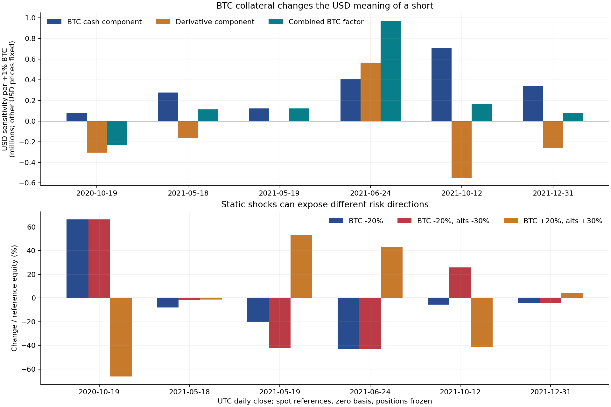
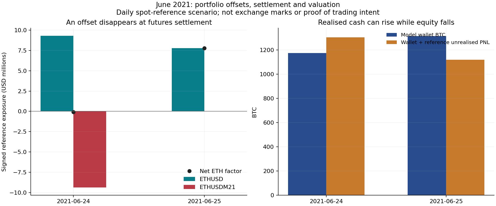

# 전체 포트폴리오 위험 복원

후속 [v0.5 확장](marks-intraday-returns.ko.md)은 관측된 월초 마크·지수 표본, 장중 수량과 조건부 입출금 조정 수익률을 추가합니다. 이 v0.4 베이시스 0 기준 연구를 보존하고 차이를 측정하며, 가정을 임의로 대체하지 않습니다.

연구 v0.4, 2026년 9월 23일. [English](portfolio-risk.en.md) · [선행 사건 연구](event-study.ko.md) · [수치 집계](../results/portfolio_risk/summary.json)

## 복원한 범위와 핵심 결과

만기 정산 8건을 포함해 **46개 계약 전체의 수량과 원가**를 계약 구조에 맞게 복원했습니다. 원장 비교 구간에서 **모든 계약의 총실현손익이 각각 정확히 일치**하며, 계좌 총액은 **3,537.32369404 BTC**입니다. **펀딩 수량 5,368건도 모두 일치**합니다. 일별 비교에서는 16개 계약·날짜 조합에 1~2사토시 차이가 남으며, 절댓값 합계는 18사토시, 순합계는 0입니다.

이는 이전 XBTUSD 중심 복원보다 포트폴리오 회계의 범위를 크게 넓힌 결과입니다. 그러나 당시 거래소 마크가격, 마진 배분, 청산 기준까지 확보한 것은 아닙니다. 아래 평가·스트레스 분석은 **일별 현물 기준가격과 무기한·만기 선물 베이시스 0을 가정한 별도 시나리오**입니다. 인증된 NAV나 실제 계좌 레버리지로 제시하지 않습니다.

주요 위험 발견은 다음과 같습니다.

- BTC 숏이 있어도 BTC 담보의 영향이 더 클 수 있습니다. BTC 역선물 합산 수량이 숏인 유효 일별 관측 **821일 중 499일**은 다른 자산의 USD 가격을 고정하면 **BTC 상승에 대한 달러 평가자산 민감도가 양수**입니다. 경제적 상쇄의 측정이며 거래자의 헤지 의도를 입증하지는 않습니다.
- **2021년 6월 24일**의 ETHUSD 롱과 ETHUSDM21 숏은 가격 민감도가 거의 상쇄됩니다. 다음 날 만기 정산으로 선물 숏이 없어져도 무기한 롱은 남았습니다. 신규 진입 주문 없이도 위험이 바뀔 수 있습니다.
- 과거 USDT 이름의 계약을 현재 명세로 해석하면 안 됩니다. 현재 API에서 USDt 정산으로 나오는 다섯 심볼은 이 자료의 시기에는 **XBt 정산 콴토**였습니다.
- 동시에 수량이 0이 아닌 계약 심볼은 최대 **8개**였습니다. 작은 잔여 수량이나 같은 기초자산의 관련 계약도 포함하므로 분산투자 정도를 뜻하지 않습니다.

## 1. 계약 정의와 원본 대조

[계약 목록](../results/portfolio_risk/contract_registry.csv)은 BTC 역선물 8개, BTC 표시 선형 계약 26개, 콴토 11개, UP 옵션 성격의 계약 1개로 구성됩니다. 모든 원본 체결의 정산 통화는 사토시 단위 XBt입니다. 공개 계약 API 응답을 저장하고, 당시 거래소 공지 및 모든 체결의 원가와 대조했습니다.

역선물의 이론상 계약당 절대 원가는 `100,000,000 / USD 표시 가격` 사토시입니다. 과거 로트 반올림에 따른 차이는 계약당 최대 0.5사토시입니다. 선형·콴토 계약의 `abs(execcost) / 수량`은 선택한 승수와 표시 가격의 곱에 부동소수 정밀도 범위 내에서 일치합니다. 회계에는 이론값을 재생성해 넣지 않고 실제 기록된 체결 원가를 사용했습니다.

공개 계약 API는 만기 종료·미상장 계약도 반환하지만 **과거 시점별 명세를 보장하는 버전 기록은 아닙니다**. 현재 응답의 상태, 만기일, 로트, 마진 항목이나 실시간 환산 계수를 과거 체결에 그대로 적용하지 않았습니다. [BitMEX 계약 API 설명](https://docs.bitmex.com/api-explorer/get-instruments).

| 과거 심볼 | 표시 가격 | 과거 승수, 표시 가격 1단위당 사토시 | 과거 정산 | 현재 API 정산 |
| --- | --- | ---: | --- | --- |
| ADAUSDT | ADA/USDT | 1,000,000 | XBt | USDt |
| BNBUSDT | BNB/USDT | 100 | XBt | USDt |
| DOGEUSDT | DOGE/USDT | 100,000 | XBt | USDt |
| DOTUSDT | DOT/USDT | 10,000 | XBt | USDt |
| LINKUSDT | LINK/USDT | 10,000 | XBt | USDt |

ADA·DOT의 과거 명세와 새 이름 계약과의 차이는 [2021년 9월 명칭·정산 공지](https://www.bitmex.com/blog/ada-bnb-doge-dot-and-fil-quanto-perpetuals-new-listing-and-early-settlement-of-contracts-due-to-naming-conventions)에 나옵니다. [BNB 출시 공지](https://www.bitmex.com/blog/the-bnbusdt-quanto-perpetual-contract-comes-to-bitmex), [DOGE 출시 공지](https://www.bitmex.com/blog/every-doge-has-its-day-introducing-the-new-dogeusdt-quanto-perpetual-contract), [LINK 출시 공지](https://www.bitmex.com/blog/introducing-a-new-linkusdt-quanto-perpetual-contract-and-increased-leverage-on-our-linkusdt-quanto-future-contract)도 BTC 정산과 승수를 뒷받침합니다. 이러한 과거 명세 적용은 계약 목록에 별도 표시했습니다.

## 2. 수량·만기 정산·현금 회계

Trade와 Settlement는 부호 있는 수량을 바꾸고 Funding은 수량을 바꾸지 않습니다. 동일 시각·주문·방향 체결을 선행 회계 검증처럼 묶으며, 주문 ID가 0인 행은 체결 식별자로 분리합니다. 부분 종료·반전 원가는 사토시 정수로 배분하고 나머지 보유 원가를 보존합니다. 역선물과 선형·콴토는 원가 차이를 손익으로 바꾸는 부호가 서로 다릅니다. 모든 Settlement가 정확히 잔여 수량을 종료하고 원가도 0으로 만드는지 확인했습니다.

이 처리가 중요한 사례는 **2019년 6월 28일 정산된 XBTM19 1,800,000계약 숏**, **2021년 6월 25일 정산된 ETHUSDM21 136,076계약 숏**입니다. Trade만 누적하면 만기 이후에도 존재하지 않는 포지션이 남습니다. UP 계약은 가격 0으로 정산됐으며 유효한 원본 값입니다. 이전 옵션 공정가치를 모르는 상황에서도 실제 정산에 따른 회계 손익은 맞출 수 있습니다.

최초 수량 0을 전제로 45개 계약은 최종 수량이 0입니다. **XBTUSD만 29,080,100계약 숏**이 남고, 절대 보유 원가는 **569.22139118 BTC**입니다. [펀딩 수량 대조](../results/portfolio_risk/funding_inventory_checks.csv)는 펀딩 관측이 있는 시점의 수량 복원을 지지하지만, 펀딩 없는 계약이나 공개되지 않은 다른 계좌까지 독립적으로 인증하지는 않습니다.

[계약별 회계 결과](../results/portfolio_risk/accounting_by_contract.csv)는 각 심볼을 원장과 대조합니다. XBTUSD의 기존 미세 차이 12일 외에 ETHU18과 LINKUSDT 각각 두 날짜에 1사토시 차이가 있습니다. [잔여 차이 목록](../results/portfolio_risk/remaining_daily_residuals.csv)에 그대로 남겼으며 합계를 맞추는 임의 보정값은 없습니다.

두 시간 기준을 구분합니다.

1. **회계 검증:** 전일 정오부터 기장일 정오까지의 UTC 구간.
2. **위험 스냅샷:** 다음 UTC 자정 직전까지의 포지션·모델 현금과, 그 직전 달력 날짜의 일별 종료 기준가격.

모델의 일말 지갑 현금은 체결 실현손익에서 기록된 비용·펀딩을 반영하고, 해당 날짜까지 완료된 입출금을 합산한 값입니다. 정오 지갑 잔액을 자정 포지션에 붙이지 않았습니다. 입출금 시각은 잘려 있고 2018년 4월 27~28일 출금의 날짜·처리 순서도 여전히 미확정입니다. 두 날짜는 별도 표시했으며 원본 날짜를 유지했습니다.

2021년 12월 31일 UTC 종료 시점의 모델 현금은 **737.28931453 BTC**입니다. 마지막 제공 정오 잔액 **737.26973405 BTC**보다 **0.01958048 BTC** 많은 이유는 이전 연구에서 확인한 이후 펀딩 두 건입니다. 추가 수익을 임의로 붙인 것이 아닙니다.

## 3. 평가 가정과 자료 범위

일별 복원 구간은 최초 계좌 사건이 관측된 **2018년 3월 5일**부터 2021년 12월 31일까지입니다. 요청 기간 중 3월 1~4일에는 관측된 계좌 사건이 없으며, 이를 검증된 무위험 기간으로 제시하지 않습니다.

Coin Metrics에서 ETH·XRP·BCH·LTC·ADA·EOS·TRX·DOGE·BNB·DOT·LINK·YFI의 과거 USD 기준가격 12종을 추가 확보했습니다. BTC와 USDT는 기존 저장본을 재사용합니다. URL, 수집 시각, 해시는 [수집 기록](../data/portfolio_market/retrieval.json)에 있으며 앞선 시장 파일을 덮어쓰지 않았습니다.

| 계약의 표시 가격 | 사용한 대리 가격 |
| --- | --- |
| BTC/USD 역선물 | BTC USD 기준가격 |
| 알트코인/USD 콴토 | 해당 알트코인 USD 기준가격 |
| 알트코인/USDT 콴토 | 알트코인 USD 기준가격 ÷ USDT USD 기준가격 |
| 알트코인/BTC 선형 | 알트코인 USD 기준가격 ÷ BTC USD 기준가격 |

실제 파생상품 마크가격이 아닌 기초자산 기준값입니다. 기본 시나리오는 무기한·만기 선물 모두 베이시스가 0입니다. 각 계약의 잔여 원가를 이용해 미실현 BTC 손익을 계산하고, 지갑 BTC와 합산한 뒤 BTC USD 기준가격으로 환산합니다.

열려 있는 일반 계약에는 필요한 일별 기준가격이 모두 있습니다. **1,398개 일별 스냅샷 중 1,397개**에서 시나리오 평가가 가능합니다. **2018년 5월 3일**에는 XBT7D_U110 5계약이 열려 있으나 옵션 공정가치가 없어 전체 평가자산과 위험 비율을 결측으로 남겼습니다. 0이나 오래된 체결 가격으로 대체하지 않았습니다. [당시 UP 상품 공지](https://www.bitmex.com/blog/ups-and-downs-product-update)도 일반 BTC 선물과 구분해야 하는 근거입니다.

2018년 3월 22~28일의 7개 스냅샷은 재구성 현금과 포지션이 모두 0입니다. 이때 평가자산을 분모로 하는 비율은 계산하지 않습니다. 나머지 **1,390개**는 완전한 입력과 양의 기준 평가자산을 갖습니다. 자료 비율은 스냅샷의 계산 가능 여부이며 경제적 위험의 포착 비율이나 진위 인증률이 아닙니다.

## 4. BTC 담보를 포함하면 포트폴리오 방향이 달라집니다

다른 포지션 없이 BTC 지갑 현금 W, 부호 있는 역선물 수량 q, 진입가 Pe만 있으면:

```text
달러 평가자산 E(P) = W × P + q × (P / Pe − 1)
dE / dP = W + q / Pe
```

숏은 BTC 담보 노출의 일부를 상쇄합니다. 그 가격 민감도가 담보의 민감도보다 커야 달러 기준으로 순수한 BTC 하락 노출이 됩니다. 콴토와 BTC 표시 알트 계약이 있으면 항이 추가되므로, 원시 계약 수를 더하는 대신 포트폴리오 전체를 다시 평가했습니다.

CSV의 `btc_factor_delta_usd`, `btc_derivative_delta_usd`, `alt_factor_delta_usd`는 상대 가격 변화 1단위당 국소 USD 민감도로, ±0.01% 중앙차분으로 계산했습니다. +1% 변화의 국소 USD 효과를 구하려면 `0.01`을 곱합니다. 알트 요인은 BTC 외 자산의 USD 가격을 함께 바꿉니다. 유한한 동반 충격은 이 1차 민감도의 단순 합 대신 상호작용까지 포함한 전체 재평가로 계산합니다.

**2021년 12월 31일 UTC 종료 시점**의 결과는 다음과 같습니다.

| 항목 | 기준가격 시나리오 결과 |
| --- | ---: |
| BTC 기준가격 | 46,355.11733 USD |
| 모델 지갑 현금 | 737.28931453 BTC |
| XBTUSD 미실현손익 | +58.11172056 BTC |
| 기준 평가자산 | 795.40103509 BTC / 약 3,687.09만 USD |
| BTC +1%일 때 현금 기여 | +341,771 USD |
| BTC +1%일 때 파생상품 기여 | −263,863 USD |
| BTC +1%일 때 합산 기여 | **+77,908 USD** |

역선물 숏의 액면이 2,908.01만 USD이지만 합산 포트폴리오는 여전히 달러 기준 BTC 상승 민감도가 양수입니다. 포지션과 다른 요인을 고정한 BTC −20% 충격에서는 평가자산이 약 **155.82만 USD, 4.23%** 감소합니다. 과거 시나리오 계산이며 청산가격 추정이나 현재 헤지 권고가 아닙니다.



유효 BTC 역선물 순숏 관측 **821일 중 499일, 60.78%**가 BTC 요인에 양수입니다. 숏을 모두 독립적인 하락 베팅으로 읽으면 이 스냅샷들을 잘못 분류합니다. 다만 다른 USD 가격을 고정한 BTC 민감도가 양수여도, 암호화폐가 함께 상승하면 알트코인 숏 손실이 이를 압도할 수 있습니다.

## 5. ETH 상쇄와 만기에 따른 보호 효과 소멸

**2021년 6월 24일 UTC 종료 시점**에는 다음 포지션이 있습니다.

| 계약 | 부호 있는 수량 | USD 기준 노출 |
| --- | ---: | ---: |
| ETHUSD | +135,099 | +9,302,347 |
| ETHUSDM21 | −136,076 | −9,369,619 |
| XBTUSD | +12,023,900 | +12,023,900 |
| XBTU21 | +40,000,000 | +40,000,000 |

ETH 두 계약의 절대 노출 합은 약 **1,867.20만 USD**이지만 같은 현물 대리 가격에서 순 ETH 민감도는 **−67,272 USD**에 불과합니다. BTC를 고정하고 ETH·알트 USD 가격만 30% 내리면 평가자산에 약 **20,182 USD 이익**이 발생합니다. 경제적으로 상당한 상쇄와 일치하지만 거래자의 의도, 실제 당시 베이시스, 거래소의 마진 상계 적용까지 확정하지는 않습니다.

ETH 선물 숏은 **6월 25일 11:59:59.999999 UTC**에 정산됩니다. 정산 직전·직후 수량을 보면 ETHUSD는 **+135,099계약** 그대로이고, ETHUSDM21은 **−136,076에서 0**이 됩니다. 실제 원본 정산으로 확인한 변화이며 현재 API 만기일을 보고 추정한 것이 아닙니다. [시점별 수량](../results/portfolio_risk/event_checkpoint_inventory.csv).

다음 일별 종료 시점의 순 ETH 기준 노출은 **+778.11만 USD**입니다. 알트만 −30%인 시나리오는 24일 평가자산 대비 약 **+0.04%**에서 25일 **−6.58%**로 바뀝니다. BTC 역선물 롱 합계도 5,202.39만에서 7,002.18만 계약으로 증가했습니다. BTC −20%·알트 −30% 동반 충격은 **−42.98%에서 −64.73%**로 변합니다. 그 차이에는 신규 체결, 가격 변화, 평가자산 변화도 들어가므로 만기 하나의 효과로 전부 귀속하지 않습니다.



두 UTC 종료 시점 사이 지갑 현금은 **1,174.75977610에서 1,314.15497918 BTC**로 늘지만, 기준 평가자산은 **1,304.61597254에서 1,119.83723019 BTC**로 줄어듭니다. 축적된 이익의 실현과 다른 포지션의 가격 손실이 함께 발생하면 이런 결과가 가능합니다. 큰 이익 기장이나 현금 잔액 증가만으로 총자산 증가를 판단할 수 없음을 보여줍니다. 실제 거래소 마크가격 NAV가 아닌 현물 기준 시나리오라는 한계는 유지합니다.

## 6. 스트레스 결과와 위험 집중

시나리오는 BTC ±20%, BTC 외 모든 자산의 USD 가격 −30%, BTC·알트의 −20%·−30% 및 +20%·+30% 동반 변동, USDT/USD −5%, 만기 선물 표시 가격의 베이시스 ±5% 등 여덟 가지입니다. 베이시스 충격에서는 무기한 대리 가격을 고정합니다. 포지션·현금·원가는 유지하고, 콴토의 BTC 손익과 그 BTC의 달러 가치 간 상호작용도 재평가합니다. 이후 비용·펀딩·청산·체결 제약·포지션 조정은 모사하지 않습니다. 충격 크기는 설명용 가정이며 추정 확률이나 분위수가 아닙니다.

| UTC 종료일 | BTC −20% | 동반 하락 | 동반 상승 | 해석 |
| --- | ---: | ---: | ---: | --- |
| 2020-10-19 | +66.33% | +66.33% | −66.33% | 큰 BTC 숏이 담보 민감도를 초과 |
| 2021-05-18 | −8.08% | −1.88% | −1.22% | BTC·ETH 숏과 BTC 담보가 상호작용 |
| 2021-05-19 | −19.99% | −42.42% | +53.64% | 장중 변화 이후 ETH 롱의 하락 위험 추가 |
| 2021-06-24 | −43.01% | −42.98% | +42.96% | ETH는 대부분 상쇄되지만 BTC 위험은 큼 |
| 2021-10-12 | −5.64% | +25.88% | −41.63% | BTC 요인은 양수지만 ETH·XRP 숏이 동반 상승에 취약 |
| 2021-12-31 | −4.23% | −4.23% | +4.23% | BTC 숏이 BTC 현금 노출을 일부 상쇄 |

분모는 각 스냅샷의 양의 기준 평가자산이며, 실제 일별 투자수익률이 아닙니다. [전체 시나리오](../results/portfolio_risk/daily_stress.csv), [현금·계약별 기여](../results/portfolio_risk/focus_stress_contributions.csv).

5월 사례는 일별 표본의 한계도 보여줍니다. 18일 UTC 종료 시점에는 BTC·ETH가 모두 숏인데, 정확한 **19일 12:00**에는 XBTUSD **+30,702,992**, ETHUSD **+181,667**계약 롱입니다. 19일 UTC 종료 때는 XBTUSD가 거의 0인 소량 숏, ETHUSD는 120,118계약 롱입니다. 일별 스냅샷만으로 큰 손실 직전의 최대 장중 위험을 확정할 수 없습니다.

파생상품 절대 기준 노출 합을 기준 평가자산으로 나눈 최대 비율은 **2018년 3월 20일의 32.27**입니다. 평가자산이 작은 초기 시기이며 해당 날짜의 입금도 있습니다. 거래소 레버리지 설정이나 실제 장중 최대 레버리지가 아닌 대리 가격 비율입니다. 일부 고정 충격은 평가자산의 100%를 넘는 감소와 음수의 가상 평가자산을 만듭니다. 유지증거금 청산 경로를 모사하지 않으므로 실제 손실·파산 사건이나 거래자에게 청구 가능한 금액으로 해석할 수 없습니다.

USDT 표시 가격 위험과 USDT 담보 위험은 다릅니다. USDT −5% 시나리오에서는 자산 USD 가격이 고정되고 USDT 표시 가격이 `1 / 0.95`배로 오릅니다. USDT 담보를 보유하지 않아도 과거 콴토 숏에서 손실이 날 수 있습니다. 해당 시나리오의 최대 비율 감소는 **2021년 5월 10일 약 4.15%**입니다. 실제 디페그에서는 다른 자산, 베이시스와 유동성도 동시에 바뀔 수 있으며 이 단독 충격에는 포함하지 않았습니다.

## 7. 아직 확정할 수 없는 것

제공 계좌의 전체 수량·실현 원가 모델은 원장과 잘 맞습니다. 실제 레버리지, 유지증거금 여유, 청산까지의 거리를 계산하려면 당시 계약 마크·지수가격, 만기 베이시스, 장중 입출금 시각, 미체결 주문의 마진, 마진 방식과 위험 한도 이력이 더 필요합니다. 달러 평가자산의 단순 낙폭에는 출금과 BTC 환산 변화도 섞이므로 투자수익률로 제시하지 않았습니다.

공분산 모델, VaR, 기대손실(ES), 샤프지수, CAGR은 추정하지 않았습니다. 계약 이름이 여덟 개여도 같은 암호화폐 위험 요인을 공유할 수 있습니다. 고정 충격은 주어진 변화에서의 노출을 보여주며 사건 확률이나 위기 때 분산 효과를 입증하지 않습니다. 큰 역사적 성과와 큰 꼬리 위험, 규모 변화, 경제적 상쇄 포지션은 공존할 수 있고, 이것만으로 현재 재현 가능한 신호를 특정할 수는 없습니다.

## 8. 재현

```text
python scripts/portfolio_risk.py
python scripts/portfolio_figures.py
python -m unittest discover -s tests -v
python scripts/verify_portfolio_risk.py
```

저장된 입력으로 오프라인 재현할 수 있습니다. `python scripts/fetch_portfolio_market.py`는 선택적인 공개 데이터 수집 단계이며, 이미 성공적으로 저장한 입력은 재사용합니다. 나중에 새로 내려받으면 제공자가 과거 자료를 수정했을 수 있으므로 별도 스냅샷으로 취급해야 합니다.

[검증 결과](../results/portfolio_risk/validation.json)는 원본 부호 수량, 계약별 원장 총액, 모든 펀딩 수량, 만기 종료, 결측 처리, 개별 평가손익 합산, 스트레스 기여 합계를 확인합니다. 원본 계좌 파일과 v0.1~v0.3 결과는 보존했습니다. 새 근거는 `results/portfolio_risk/`에 있으며 기존 보유 구간 정의나 2026년 시장 스냅샷을 임의로 대체하지 않습니다.
