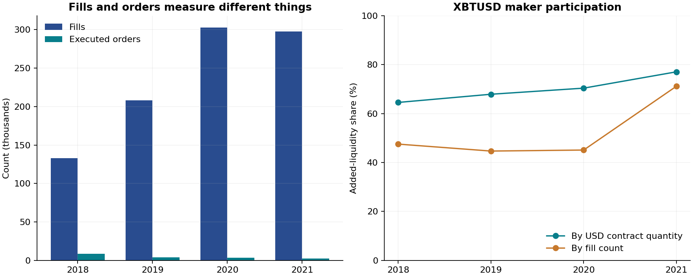
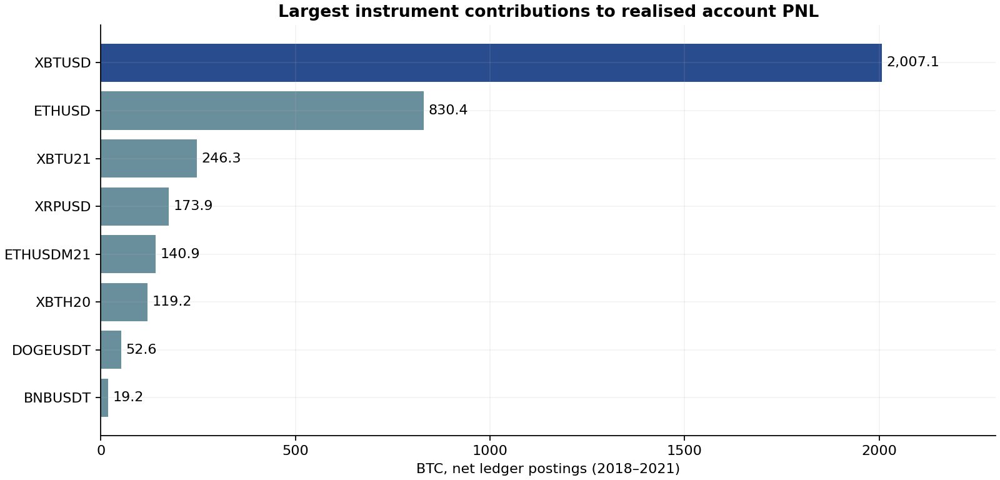
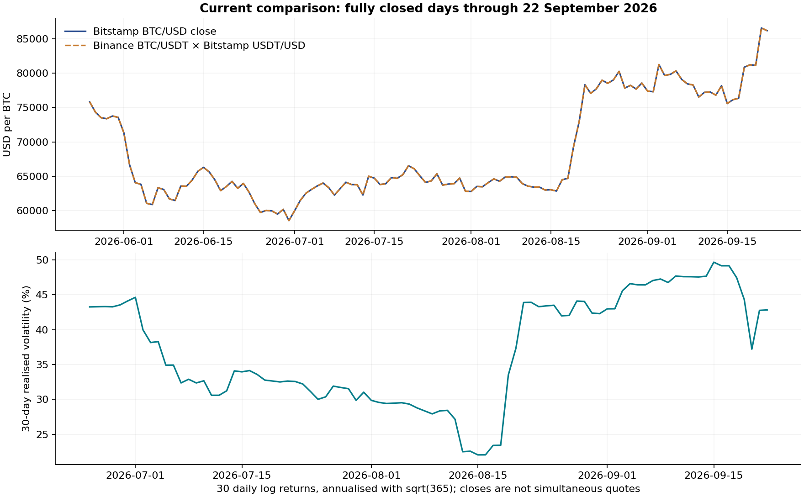

# BTC-Legend: 체결·성과·현재 적용 가능성 연구

**연구 v0.1 - 2026년 9월 23일** · [English](research.en.md) · [방법론](../research/methodology.ko.md) · [출처](../research/sources.md)

회계 후속 업데이트: [v0.2 차이 추적 연구](accounting-audit.ko.md)에서 총모델 차이를 설명하고 잔액 차이 154일을 분류했습니다. 아래 포지션 구간 통계는 기존 개별 체결 순서 방식의 기준 결과로 유지합니다.

사건 후속 업데이트: [v0.3 큰 이익·손실·청산 연구](event-study.ko.md)에서 극단 기장일과 펀딩 포함 보유 구간을 복원했습니다. 전체 텍스트 검색 결과 청산 표시 체결은 59건이며, 아래의 주문 ID가 0인 28건 외에 정상 주문 ID를 가진 ETHUSD 31건이 포함됩니다.

## 연구 결론

제공된 계정 기록은 **BTC 상승장과 하락장을 모두 포함한 기간에 상당한 BTC 실현이익을 냈다**는 사실을 보여줍니다. 단순한 BTC 보유나 하나의 기술적 지표만으로 성과를 설명하기는 어렵습니다. 양방향 거래, 주문 규모 확대, 유동성 공급 비중 증가, 비트코인 외 계약의 수익 기여가 확인됩니다. 동시에 청산 표시 체결과 큰 실현손실도 존재합니다.

수익의 규모는 측정할 수 있지만, 그 수익을 만든 의사결정은 일부만 관찰할 수 있습니다. 이 연구는 **재현 가능한 매매 규칙이나 현재 시장에서의 수익성을 입증하지 않습니다.** 대신 검증할 만한 가설과 데이터가 지지하지 않는 설명을 구분합니다.

계정 귀속은 사용자가 제공한 설명에 따릅니다. 워뇨띠 본인의 전체 자산이나 모든 거래소 계좌를 검증한 자료는 아닙니다. 아래에서는 원장 관측값, 조건부 복원값, 해석을 구분합니다.

## 1. 데이터가 실제로 담고 있는 것

| 구분 | 확인 결과 |
| --- | ---: |
| 전체 체결 이벤트 행 | 1,444,583 |
| 실제 Trade 체결 | 1,439,207 |
| 펀딩 / 정산 이벤트 | 5,368 / 8 |
| 상품 심벌 | 46 |
| 식별 가능한 체결 주문 | 23,416 |
| 주문 ID가 0인 청산 표시 체결 | 28 |
| XBTUSD 체결 / 식별 가능한 주문 | 941,007 / 18,397 |
| 완료된 지갑 거래 | 2,246 |

[집계 근거](../results/summary.json). 요청 기간은 2018년 3월 1일부터지만 실제 최초 기록은 **3월 5일**입니다. 원본 CSV는 수정하지 않았습니다.

XBTUSD는 주문당 체결 수 중앙값이 **19개**, 95백분위가 약 **201개**, 최대가 **2,638개**입니다. 체결 한 건을 매매 판단 한 번으로 해석하면 빈도가 크게 부풀려집니다. 주문도 진입·헤지·청산의 일부일 수 있어 완결된 거래와 동일하지 않습니다. 포지션이 0에서 시작해 다시 0이 되거나 반대 방향으로 넘어가는 기준으로는 조건부 복원된 종료 구간이 2,589개입니다.

주문 ID가 전부 0인 28건은 원문에 모두 `Liquidation`으로 표시되어 있습니다. 이를 같은 주문으로 합치거나 결측치로 버리지 않았습니다. 포지션·비용 계산에는 포함하고 부모 주문 식별에서만 분리했습니다. **청산 체결 28건은 독립된 청산 사건 28번이라는 뜻이 아닙니다.**

## 2. 이익과 출금, 그리고 수익률의 차이

| 원장 구성 | BTC |
| --- | ---: |
| 완료된 입금 | 14.48925714 |
| 순실현손익 | 3,537.32369404 |
| 완료된 출금 | −2,814.54321713 |
| 마지막 지갑 잔액 | **737.26973405** |

총액은 **오차 0사토시**로 일치합니다. 취소된 출금 7건은 현금흐름에서 제외했습니다. 그러나 총 입금이 동시에 투자된 원금이라는 뜻도, 첫 입금이 전체 초기 재산이라는 뜻도, 출금이 원화·달러 현금화라는 뜻도 아닙니다.

지갑 잔액에는 미실현손익이 포함되지 않습니다. 마지막 XBTUSD 포지션은 복원 기준으로 **29,080,100 USD 계약 순숏**이 남아 있습니다. 마지막 잔액을 첫 입금으로 나눠 수익률이나 연복리수익률을 제시하면 추가 입출금·미결제 포지션·외부 자산을 잘못 취급하게 됩니다. 실제 레버리지나 샤프지수도 현재 자료만으로 확정하지 않습니다.

원래 일별 재구성 잔액과 마지막 표시 잔액의 차이는 154일, 최대 1.0012 BTC입니다. [후속 연구](accounting-audit.ko.md)에서는 152일을 표시 정밀도로, 2일을 한 출금의 날짜·잔액 반영 순서 충돌로 설명했습니다. 후자는 별도 순서 시나리오에서 맞지만 실제 처리 날짜는 미확정이며 원본을 임의 정정하지 않았습니다.

## 3. 어디서 이익을 냈는가

| 계약 | 순실현손익 BTC | 계좌 순실현이익 대비 |
| --- | ---: | ---: |
| XBTUSD | 2,007.08464645 | 56.74% |
| ETHUSD | 830.36450739 | 23.47% |
| XBTU21 | 246.33373320 | 6.96% |
| XRPUSD | 173.86144941 | 4.91% |
| ETHUSDM21 | 140.93425904 | 3.98% |
| XBTH20 | 119.20156973 | 3.37% |

이는 비용·펀딩이 반영된 상품별 원장 기여액입니다. 각 전략에 투자한 자본 대비 수익률은 아닙니다. 손실 상품도 있습니다. BCHUSD **−69.93503012 BTC**, LINKUSDT **−17.84627291 BTC**, XRPU18 **−17.74146044 BTC** 등이 포함됩니다. [전체 상품별 손익](../results/wallet_pnl_by_symbol.csv).

| 연도 | BTC 현물 가격 수익률 | 전체 계약 실현손익 BTC | XBTUSD BTC | ETHUSD BTC |
| --- | ---: | ---: | ---: | ---: |
| 2018년 3월부터 | −64.23% | 188.43 | 175.59 | 7.02 |
| 2019 | +94.39% | 516.37 | 511.73 | 18.90 |
| 2020 | +304.93% | 763.64 | 573.17 | 14.41 |
| 2021 | +59.72% | 2,068.88 | 746.60 | 790.03 |

현물 수익률은 기간 직전 종가를 기준으로 계산했습니다. BTC 단위 실현이익은 운용 규모가 달라지는 금액이므로 현물 수익률과 같은 단위의 비교가 아닙니다. 다만 하락한 2018년에도 BTC 이익을 냈고 조건부 숏 거래에서도 이익이 관찰되므로, 단순 현물 상승만으로 계좌 성과를 설명할 수는 없습니다. 이것이 곧 위험조정 초과수익의 측정치는 아닙니다.

**2021년 ETHUSD 이익은 XBTUSD보다 큽니다.** 전체 성과를 비트코인 매매 하나로 설명하면 중요한 변화를 놓칩니다. 또한 모든 체결의 정산 통화는 `XBt`입니다. 과거 DOGEUSDT 같은 콴토 상품은 USDT 이름을 사용해도 BTC를 담보로 하고 BTC 손익을 발생시켰습니다. [당시 BitMEX 설명](https://www.bitmex.com/blog/every-doge-has-its-day-introducing-the-new-dogeusdt-quanto-perpetual-contract).

## 4. 거래 방식에서 확인되는 특징

### 주문 규모 확대와 메이커 비중 증가

| 연도 | 첫 체결 연도 기준 XBTUSD 주문 | 주문 크기 중앙값, USD 계약 | 주문당 체결 중앙값 | 계약 수량 기준 메이커 비중 |
| --- | ---: | ---: | ---: | ---: |
| 2018년 3월부터 | 8,805 | 200,000 | 8 | 64.56% |
| 2019 | 3,740 | 700,000 | 31 | 67.91% |
| 2020 | 3,511 | 1,500,000 | 51 | 70.41% |
| 2021 | 2,341 | 5,000,000 | 96 | 77.08% |

[주문별 집계](../results/xbtusd_order_yearly.csv), [체결 방식 집계](../results/xbtusd_yearly.csv). 2018년은 부분 연도여서 연간 주문 수를 같은 길이의 활동량으로 비교하면 안 됩니다. 계약 수량은 USD 명목금액이며 BTC 수량·투입 원금·실제 레버리지가 아닙니다.

주문당 체결 수 증가는 큰 주문이 잘게 나뉘어 체결되는 현상과 연결됩니다. 지정가 주문도 즉시 호가를 소모하면 테이커가 되므로 `Limit`이라는 이름 대신 실제 유동성 구분값을 사용했습니다. 가중 방식도 중요합니다. 2018년 메이커 비중은 계약 수량 기준 64.56%지만 체결 개수 기준으로는 47.53%입니다.

XBTUSD의 순거래 수수료는 연도별 약 **30.34, 24.00, 40.32, −9.51 BTC**입니다. 2021년 음수는 순리베이트 수취입니다. 실행 비용이 개선된 것은 관찰되지만, 리베이트만으로 약 2,007 BTC 이익을 설명하지는 못합니다. 2021년 8월에는 거래소 메이커 리베이트가 2.5bp에서 1bp로, 기본 테이커 수수료가 7.5bp에서 5bp로 바뀌었습니다. [당시 공지](https://www.bitmex.com/blog/site-announcement/now-live-revamp-of-bitmex-fee-structures-for-increased-trader-rewards). 현재 수수료를 과거 전체에 소급 적용하면 안 됩니다.

전체 계약의 펀딩 비용 합계는 **−149.57544093 BTC**, 즉 순수취입니다. 거래 수수료는 **78.00012971 BTC**, 정산 수수료는 **0.07551032 BTC** 비용입니다. 이미 지갑 순실현손익에 반영된 항목이므로 이익에 다시 더하거나 차감하지 않습니다. 펀딩은 성과를 도왔지만 대부분의 이익을 설명하는 항목은 아닙니다.

### 짧은 보유와 긴 위험 노출이 공존

조건부 XBTUSD 복원에서 종료된 포지션 구간은 **2,589개**입니다. 보유시간 중앙값은 **25.86분**, 90백분위는 **23.96시간**, 99백분위는 약 **8일**입니다. 순수 초단타라는 설명만으로는 긴 보유 구간과 마지막 미결제 포지션을 설명할 수 없습니다.

| 조건부 구간 통계 | 롱 | 숏 |
| --- | ---: | ---: |
| 종료 구간 수 | 1,279 | 1,310 |
| 거래 수수료 반영·펀딩 제외 적중률 | 77.01% | 74.58% |
| 평균 이익 구간 BTC | 2.01 | 3.70 |
| 평균 손실 구간 BTC | −4.08 | −7.21 |
| 펀딩 제외 이익 합계 / 손실 절댓값 합계 | 1.65 | 1.50 |

[통계 파일](../results/xbtusd_episode_statistics_conditional.csv). 포지션 구간은 개별 매매 아이디어와 다르고, 시대별 자금 규모도 크게 다릅니다. 이 정의에서는 평균 손실이 평균 이익보다 큽니다. 따라서 늘 작은 손절과 큰 익절로 성공했다는 설명은 지지되지 않습니다. 높은 적중률이 1보다 작은 평균 손익비를 보완하는 모습이며, 이것이 안전성이나 재현성을 뜻하지는 않습니다.

기존 평균단가 모델의 지갑 비교 차이 **0.02745234 BTC**는 [회계 후속 연구](accounting-audit.ko.md)에서 정산 종료 범위와 동시 체결 원가 배분으로 설명했습니다. 개선한 묶음 회계의 총차이는 0이고 일별 차이는 최대 2사토시입니다. 위 구간 통계는 기존 개별 체결 순서 방식을 유지하며 펀딩과 최종 미종료 구간을 제외합니다. 다른 계약의 헤지 가능성도 있어, 확정된 실전 매매 승률로 표현하지 않습니다.

### 숏을 볼 때 BTC 담보도 함께 봐야 함

BTC 담보 계좌는 담보 자체의 달러 가격 변동에 노출됩니다. XBTUSD 숏은 일부를 상쇄할 수 있습니다. 따라서 최종 순숏을 단순한 BTC 하락 전망으로 단정할 수 없습니다. 여러 계약의 반대 방향 포지션도 각각 독립된 방향성 베팅이라고 보기 어렵습니다.

지갑 W BTC, 역선물 포지션 q, 진입단가 Pe, 평가가격 P라면 다른 포지션 등을 제외한 달러 평가액은 대략 `W × P + q × (P/Pe − 1)`입니다. 가격 민감도는 `W + q/Pe`가 되어 담보와 파생 포지션을 함께 평가해야 함을 보여줍니다. 실제 레버리지는 거래소 설정 숫자를 추측할 것이 아니라 전체 평가자산과 포트폴리오 노출로 측정해야 합니다.

## 5. 손실과 수익 집중도

첫 기록부터 종료일까지 1,398일 중 전체 실현손익 합계가 양수인 날은 **912일**, 음수인 날은 **467일**, 0인 날은 **19일**입니다. 최대 이익 기록일은 **2020.03.13, +275.53795475 BTC**, 최대 손실 기록일은 **2021.05.20, −281.83947272 BTC**입니다. 원장 기록일은 관련 체결이 모두 발생한 날짜와 같지 않을 수 있습니다.

상위 10개 이익일의 합계는 **1,462.88230959 BTC**, 전체 순실현이익의 **41.36%**입니다. 누적 실현손익이 직전 최고점에서 감소한 최대 규모는 **590.97711858 BTC**입니다. 이 수치는 평가자산의 백분율 최대낙폭이나 청산까지의 여유를 나타내지 않습니다.

평균만 보면 소수 극단 구간의 중요성을 놓칩니다. 당시 포지션 규모, 손실을 감당할 자금, 스트레스 상황에서의 거래가 성과를 좌우했을 수 있습니다. 그것이 반복 가능한 능력인지 유리한 극단 결과인지 구분하려면 사건별 시장·위험 복원이 필요합니다. 손실 거래를 포함했더라도 매우 성공한 한 계정만 선택한 표본에는 선택·생존 편향이 남습니다.

## 6. 과거와 현재의 BTC 시장

과거 연도별 BTC 일간 로그수익률의 연율화 변동성은 약 **70.0–78.6%**입니다. 각 연도 구간의 종가 기준 최대낙폭은 약 **−72.4%, −48.6%, −52.1%, −53.1%**였습니다. [기간별 계산](../results/historical_market_periods.csv). 장중 극값은 포함하지 않습니다.

전일까지의 30일 수익률로 국면을 탐색적으로 나누면, 하락 분류일에 전체 계좌 **1,547.65 BTC**, 상승 분류일에 **1,791.03 BTC**, 횡보 분류일에 **198.64 BTC**가 기록됩니다. 자금 규모·상품 구성·일수·정산 시간이 다르므로 이를 국면별 수익률이나 추세추종·역추세 전략의 입증으로 사용할 수 없습니다. [국면 표](../results/historical_regimes_descriptive.csv).

### 현재 정량 스냅샷

기준은 **2026.09.22 UTC 종가**, 수집은 9월 23일입니다. [계산 자료](../results/current_market_daily.csv), [요청 URL·수집 시각](../data/market/retrieval.json).

| 관측값 | 결과 |
| --- | ---: |
| Bitstamp BTC/USD | $86,201.35 |
| Binance BTC/USDT | 86,208.56 USDT |
| Bitstamp USDT/USD | $0.99990 |
| Binance 호가의 USD 환산 | $86,199.939144 |
| 환산 후 거래소 간 종가 차이 | −0.164bp |
| BTC/USD 7일 / 30일 / 90일 수익률 | +14.06% / +10.92% / +41.34% |
| 30일 실현변동성, 연율화 | 42.82% |

최근 상승 움직임이 나타났고, 변동성은 과거 30일 변동성 분포의 약 **10.49백분위**입니다. 시장의 상태를 기술한 결과이며 매매 권고가 아닙니다. 과거는 참조가격, 현재는 개별 거래소 종가여서 정확한 백분위에는 방법 차이가 존재합니다. 변동성만으로 호가 깊이·스프레드·체결 경쟁·청산 위험을 판단할 수도 없습니다.

환산 후 작은 가격 차이는 서로 다른 거래소의 일봉 종가 비교이며, 즉시 실행 가능한 차익거래 기회가 아닙니다. 과거 USDT는 항상 1달러가 아니었습니다. 이번 과거 참조가격 표본의 최저 일별 값은 **2018.11.14 약 $0.95033**입니다. 이는 제공자 참조가격 관측값이지 장중 전체 시장 최저가 주장이 아닙니다. BTCUSDT를 그대로 USD로 취급하면 국면과 달러 성과 모두 왜곡될 수 있습니다.

7일·30일 수익률과 30일 변동성을 이용한 기술적 유사 구간은 2019.02.23, 2019.05.08, 2021.04.14, 2020.07.28, 2020.01.08입니다. 세 변수의 유사성만 보여주며, 이후 가격을 가져와 현재 포지션을 추천하지 않습니다. [비교 입력값](../results/current_historical_analogs_descriptive.csv).

### 현재로 옮길 수 있는 원리와 아직 입증되지 않은 부분

| 검토 대상 | 관찰된 근거 | 현재 적용 판단에 필요한 것 |
| --- | --- | --- |
| 주문 단위 복원 | 큰 체결 분할 | 실제 ID 보존, 강제 체결과 의사결정 분리 |
| 메이커 실행 | 수량 기준 메이커 비중 증가 | 현재 수수료·스프레드·대기열·체결 확률·역선택 |
| 단기 방향 판단 | 조건부 롱·숏 이익 | 주문 이전 신호와 새로운 미사용 기간 검증 |
| 펀딩 수취 | 순펀딩 크레딧 | 현재 펀딩 분포·베이시스·헤지 비용 |
| 규모 확대 | 주문 크기와 후기 명목이익 증가 | 평가자산·위험 한도·규모별 시장충격 |
| BTC 담보·콴토 | XBt 정산과 다수 상품 | 역선물·콴토·선형 상품 및 USD/USDT 구분 |
| 극단 상황 생존 | 큰 양·음 손익과 청산 기록 | 전체 포트폴리오 스트레스 경로·가용 증거금 |

표본 이후에는 **2024년 1월 미국 현물 비트코인 ETP 상장 승인**이라는 상품 구조 변화도 있었습니다. [SEC](https://www.sec.gov/newsroom/speeches-statements/peirce-statement-spot-bitcoin-011023). 이 사실만으로 ETF 자금 흐름의 인과효과나 모든 시장의 유동성 개선을 단정하지는 않습니다.

현재 자료에는 2021년 이후 해당 계정의 거래, 현재 BitMEX 호가·펀딩, 완전히 특정된 과거 진입 신호가 없습니다. 과거 체결을 현재 차트에 대입하는 것만으로 수익성을 입증할 수 없습니다. 다음 단계는 반증 가능한 가설을 정하고, 현실적인 체결 비용 아래 새로운 미사용 기간에서 검증하는 것입니다.

## 7. 서한의 취급과 연구 공개 범위

제공된 「90일 서한」은 단기 신호 중심에서 중장기 관점도 기록하는 방향으로 옮겨갔다는 설명을 담습니다. 하지만 발행일과 귀속이 별도로 검증되지 않았습니다. 2018–2021년 거래 시점에 알고 있었던 정보나 당시 백테스트 입력으로 사용하지 않습니다. 서한의 85k 가치 판단도 현재 매매 목표가로 쓰지 않았습니다.

이번 결과물은 로컬 연구 문서, 원본 해시, 제외 기준, 조건부 포지션 복원, 날짜가 있는 시장 스냅샷과 EN/KR 해석입니다. 미해결 회계 차이를 공개하고 비법을 복원했다고 주장하지 않습니다. 향후 데이터와 검증 결과가 뒷받침된다면 백서·시뮬레이션·소프트웨어 연구로 확장할 수 있습니다.
