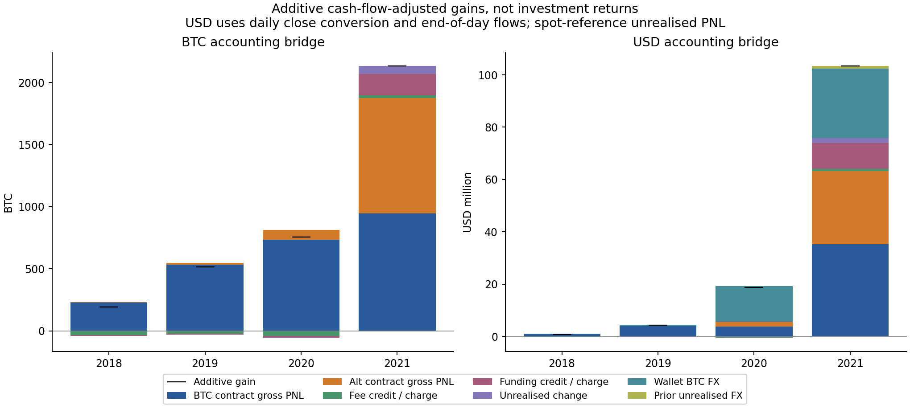

# BTC-Legend: an evidence-led account study

**Integrated research white paper, v0.7 · 23 September 2026 · English default · [한국어](whitepaper.ko.md)**

Study request: 1 March 2018 to 31 December 2021. First supplied account event: 5 March 2018. This paper integrates priorities 1-10 and provides the entry point to detailed studies, the local explorer and reproduction package. It analyses the export attributed by its provider to Wonyotti (워뇨띠); attribution, authenticity and completeness outside the supplied files are not independently certified.

## Abstract

The supplied records support a substantial account-level realised BTC gain and unusually large trading activity, but do not establish a single replicable winning strategy. There are **1,439,207 trade fills**, **23,416 identifiable executed orders**, **46 contracts**, and **59 liquidation-labelled fills**. Fragmented fills cannot be treated as independent trading decisions. Net realised wallet PNL is **3,537.32369404 BTC**; XBTUSD accounts for approximately **56.74%**, leaving material contribution from other contracts.

The research reconstructs inventory and cost allocation, reconciles aggregate contract PNL, separates observed market samples from reference valuation, and tests sensitivity of behavioural findings. Fewer orders, larger absolute size and longer holdings are descriptive features. Their independent explanation is uncertain because early and late capital ranges do not overlap. Large-loss responses also depend on the event definition and horizon. Conditional performance and collateral conversion explain the record more precisely without establishing actual continuous historical NAV, a causal source of skill or present-day profitability.

## 1. Data, units and time

The numerical inputs are four execution exports, one wallet export, saved historical reference series, historical contract metadata and 54 captured mark/index files covering 33 month-start days. Original account hashes are in the [source manifest](../results/manifest.json). The [source register](../research/sources.md) explains provider evidence and limitations; the [input lock](../research/input-lock.json) identifies the exact local numerical snapshot.

Three clocks must remain distinct: execution timestamps interpreted as UTC, wallet posting dates whose intraday strings are truncated, and daily market references labelled by their UTC interval. Wallet realised postings approximately span the preceding noon to the current noon. A posting-day loss and a positive UTC-day reference-equity change can coexist without contradiction. Cash-flow timing remains a scenario where exact timestamps are absent.

XBt means satoshis, with 100,000,000 satoshis per BTC. Contract counts, BTC balances and USD face values are not interchangeable. Historical USDT-labelled quanto contracts settle in BTC in this dataset; current products reusing their names do not define their earlier settlement mechanics. USD, USDT and XBT quote currencies are recorded explicitly in the historical registry. [Data dictionary](../research/data-dictionary.en.md).

## 2. What the accounting establishes

Completed deposits total **14.48925714 BTC**, withdrawals **2,814.54321713 BTC**, and ending wallet cash **737.26973405 BTC**. The observed wallet identity is:

```text
14.48925714 + 3,537.32369404 - 2,814.54321713 = 737.26973405 BTC
```

This is a realised cash identity, not total account equity or an investment return. The ending XBTUSD position remains short **29,080,100 USD contracts**.

The initial XBTUSD reconstruction discrepancy of **0.02745234 BTC** is explained by **0.01958048 BTC** of funding beyond the wallet posting window and **0.00787186 BTC** of inventory cost allocation. Timestamp/order grouping with integer allocation matches the refined XBTUSD aggregate; twelve posting dates retain 1-2-satoshi differences. Of 154 apparent wallet snapshot differences, 152 fit displayed precision and two involve one withdrawal's ambiguous processing chronology. These residuals are disclosed, not erased by balancing entries. [Accounting audit](accounting-audit.en.md).

The full-portfolio model reconstructs all 46 contracts and eight settlements, with all 5,368 funding quantities agreeing with reconstructed inventory. All contract aggregate net PNL matches the corresponding wallet window under the stated initial-zero-inventory assumption. This internal agreement does not authenticate the files or rule out activity in other accounts. [Portfolio reconstruction](portfolio-risk.en.md).

## 3. A profitable record with substantial adverse events

The best account posting day is **+275.53795475 BTC**, and the worst **−281.83947272 BTC**. These aggregate multiple contracts and should not be called individual winning/losing trades. All 59 liquidation-labelled fills are retained: 28 have zero UUID order IDs, and 31 belong to a real-ID ETHUSD partial-reduction order. Grouping them produces 29 observable timestamp/order groups, not a verified count of independent margin calls.

Losses, reversals and large exposures are part of the observed record. Inverse BTC gross face peaks at **USD 123,345,200** after the events at **28 July 2021 16:12:29.993437 UTC**. At that instant, offsetting BTC legs do not eliminate maturity/basis risk or the account's altcoin exposures. Summing absolute face differs from net direction and from actual exchange margin leverage. [Event study](event-study.en.md), [intraday study](marks-intraday-returns.en.md).

Thus a description such as “always small losses and large wins” is insufficient. The evidence is compatible with changing scale, instrument mix, execution costs and concentrated gains, alongside material losses. It does not reveal private information, trading intent, mental state or a complete decision rule.

## 4. What contributed to the gains?

The v0.6 additive BTC bridge is:

| Component, full calendar reconstruction | BTC |
| --- | ---: |
| Gross BTC-underlying contract realised PNL | 2,443.92287003 |
| Gross other-underlying contract realised PNL | 1,021.92060359 |
| Net execution/settlement fee contribution | −78.07564003 |
| Net funding contribution | 149.57544093 |
| Ending reference unrealised PNL | 58.11172056 |
| **Cash-flow-adjusted additive reference gain** | **3,595.45499508** |

Full-calendar realised PNL is **3,537.34327452 BTC**, including the 0.01958048 BTC timing difference described above. Ending reference unrealised PNL is conditional on the spot-reference model. Neither the additive gain nor the deposit total provides a valid denominator for a lifetime percentage return.

In 2021, gross alt-contract PNL contributes 930.8535 BTC, alongside 944.5206 BTC from BTC-underlying contracts. Fees turn into a net credit of 21.9779 BTC, and funding contributes 171.0907 BTC. These are accounting components, not proof of a deliberate funding or basis strategy. Gross and net asset contribution figures should not be mixed.

With external BTC flows converted at each day's close, the full-period additive **USD reference gain is about USD 127.045852 million**. Of this, **USD 40.601787 million** is prior wallet BTC revaluation. This explicitly separates the USD effect of holding BTC from current-day converted contract PNL. It is not a record of dollars actually realised or withdrawn, and attribution of interaction terms depends on the declared convention. [Full BTC/USD attribution](behavior-attribution-robustness.en.md).



## 5. Behavioural changes and robustness

XBTUSD executed orders per calendar day decline from 29.16 in 2018 to 6.41 in 2021, while median absolute order face rises from USD 200,000 to USD 5 million. The entry-cohort mean holding duration capped at seven days rises from 2.890 to 43.851 hours. The ending open position is retained in that capped measure. [Behaviour study](behavior-changes.en.md).

Capital/market adjustment materially changes the interpretation. The maximum 2018 prior-day reference capital is roughly USD 534,315; the minimum in 2021 is roughly USD 12,267,063. Their ranges do not overlap. In the adjusted model, the 2021 order-frequency association is uncertain and the order-size year coefficient changes sign; longer capped holding still has a positive association under 7/14/28-day dependence settings. These are model-dependent associations without an identified same-capital counterfactual.

Sensitivity tests use 10-second/one-minute/five-minute sampling and 30/60/300-second freshness. Relative to ten-second observations on the same 33 monthly sample days, five-minute sampling can omit up to roughly USD 802,893 of a daily gross-value peak. Stricter freshness reduces coverage; monthly samples cannot be interpolated into complete NAV. BOD/MID/EOD cash assumptions produce a 2019 conditional BTC annual-return spread of 89.60 percentage points. Invalid 2018 days remain invalid and are not skipped to manufacture a full-period chain.

Large-loss selection by absolute BTC leaves seven nonoverlapping events; selection by loss relative to prior reference capital leaves nine. Absolute-loss events tend to show next-day reduction but a positive median gross-face change over 30 days. Relative-loss selection changes that pattern. Few usable control dates remain. A universal de-risking, re-entry or profitable recovery rule is not established. [Adjusted behaviour, sensitivity and post-loss study](behavior-attribution-robustness.en.md).

## 6. Then and now

The retained current-market comparison uses completed UTC daily candles through **22 September 2026**. It separately observes BTC/USD, BTC/USDT and USDT/USD and treats cross-venue conversion as descriptive. v0.7 does not refresh that snapshot. Historical market-state similarity does not establish similar liquidity, fee tiers, queue position, basis, collateral or execution competition. [Original market comparison](research.en.md).

All 2018-2021 account observations have already been examined. A later split of that same history cannot be called an untouched confirmation set. A credible future transferability study needs fixed hypotheses, genuinely unused observations, contemporaneous costs and liquidity, and explicitly rejected assumptions. This paper supplies no current buy/sell instruction and no claim of a profitable bot. Later simulation or trading software remains a possible separate research stage.

## 7. Priorities 9 and 10: usable research infrastructure

The **local explorer** brings date-selected observations together: opening/closing positions, real parent orders, paged inventory events, selected raw execution fields with file/row references, wallet postings, funding, daily USD/USDT references, captured monthly marks, and conditional cash-timing returns. English is the default, with Korean switching. Account-wide cards stay account-wide when contract-specific tables are filtered. Missing account observations, missing option valuation, missing marks and cash chronology uncertainty remain visible. No remote assets, exchange credentials or trading endpoint are used.

The **reproduction package** adds an offline runner with preflight hash validation, complete CSV-header inventory, semantic data dictionary, runtime record, per-file package hashes and a deterministic local review ZIP. Original input files, private SQLite and large regenerable caches are excluded from the ZIP and identified as external prerequisites. It contains detailed derived observations, so original exclusion is not anonymisation or a redistribution license. Nothing is automatically published.

Run instructions and review-package boundaries: [Reproduction guide](../research/reproduction.en.md). Local app: [http://127.0.0.1:8765](http://127.0.0.1:8765), after starting the documented server. All detailed studies remain available rather than being replaced by this synthesis.

## 8. Research map and outstanding evidence

| Priority | Completed output | Evidence boundary |
| --- | --- | --- |
| 1 | Accounting audit v0.2 | Aggregate agreement; small daily residuals and cash chronology remain |
| 2 | Extreme events v0.3 | Labels and reconstructed paths; independent margin-call count unknown |
| 3 | Portfolio reconstruction v0.4 | Full supplied contract inventory; conditional valuation |
| 4 | Behaviour changes v0.5 | Parent-order and episode description, not motives |
| 5 | Adjusted behaviour v0.6 | Dependence-aware associations; no early/late capital overlap |
| 6 | Attribution v0.6 | Accounting bridge, not causal alpha |
| 7 | Sensitivity v0.6 | Tested alternatives within available coverage |
| 8 | Post-loss response v0.6 | Small selected samples; noncausal comparisons |
| 9 | Local research explorer v0.7 | Read-only view of retained evidence, not live account monitoring |
| 10 | Integrated paper and reproduction bundle v0.7 | Reviewable local package; exact rebuild requires original inputs |

The unit suite contains **44 passing tests**; explorer validation has **34 passing checks**. Prior financial validations were run through the new offline verification mode. Browser interactions and missing-data cases were checked separately. This release did not rerun the entire historical financial pipeline from scratch and does not claim external audit certification.

The most consequential missing evidence is continuous historical marks/indices, original cash processing timestamps, account margin/risk-tier history and genuinely independent confirmation data. Those gaps limit actual NAV returns, liquidation-distance claims and causal strategy identification. The present contribution is a traceable, bilingual account study with reproducible internal calculations and a practical way to inspect their evidence.
